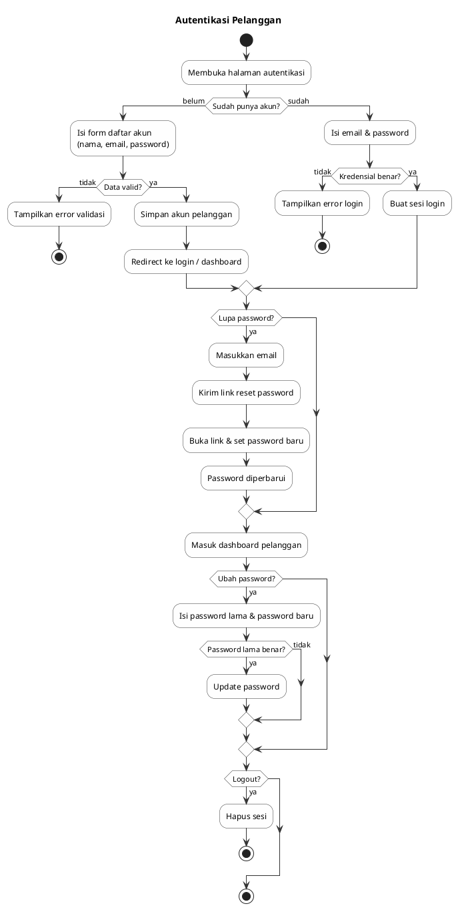
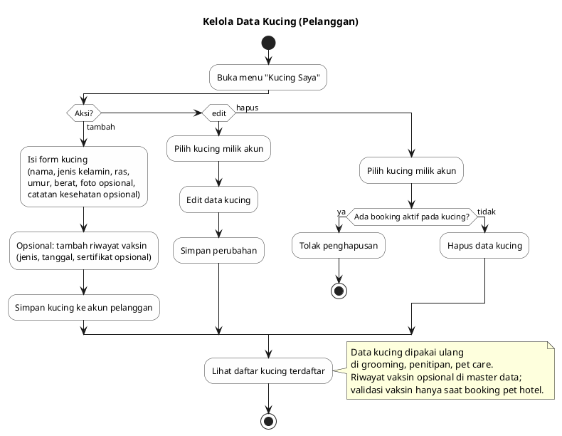
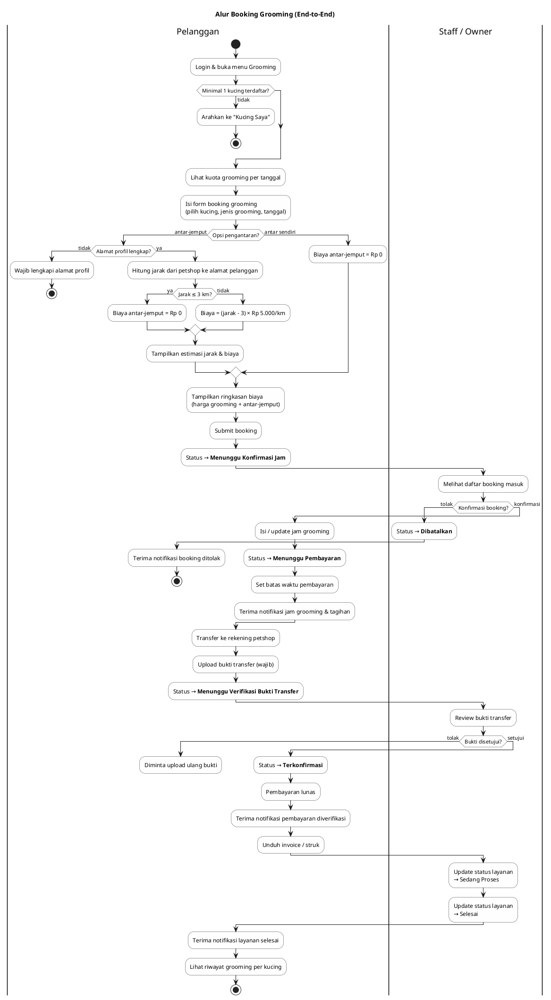
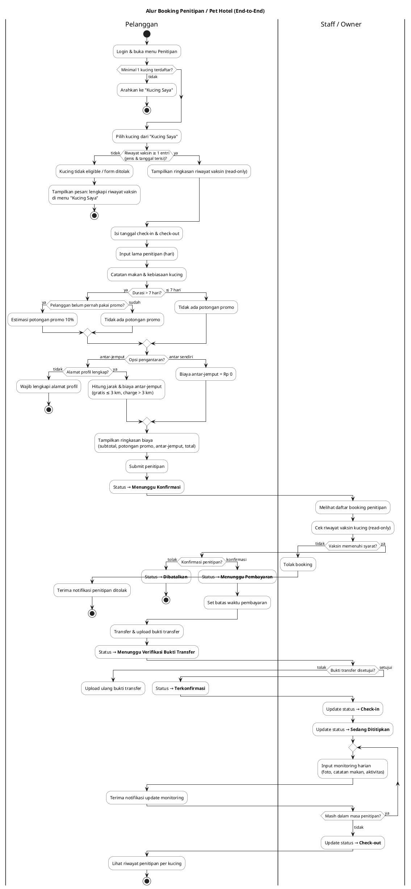
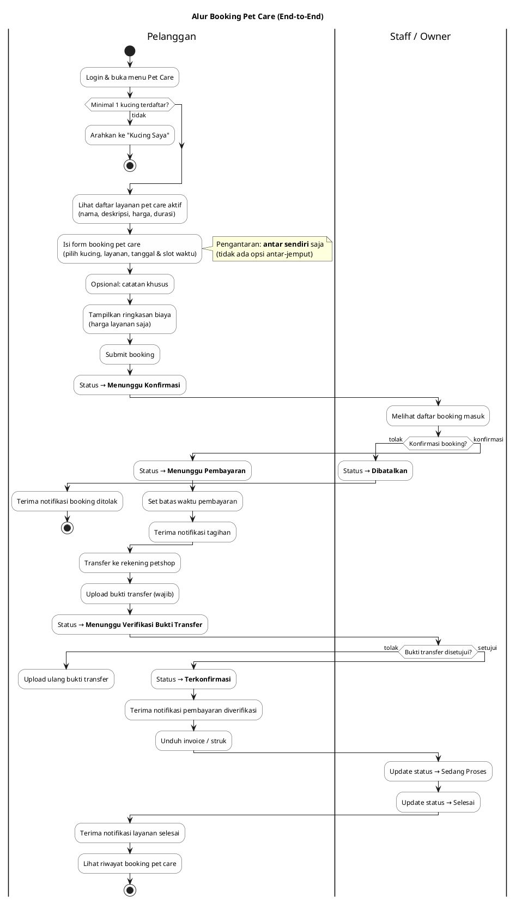
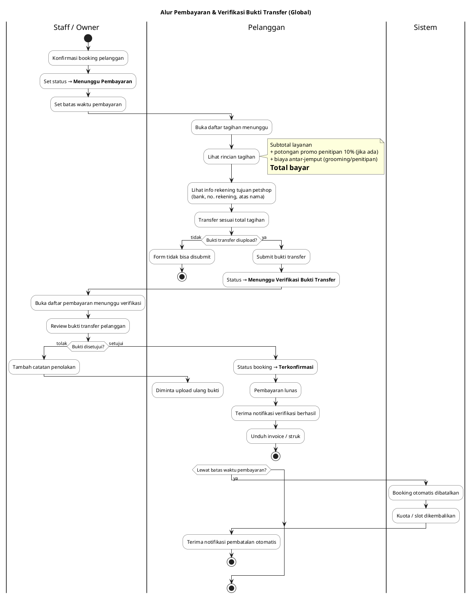
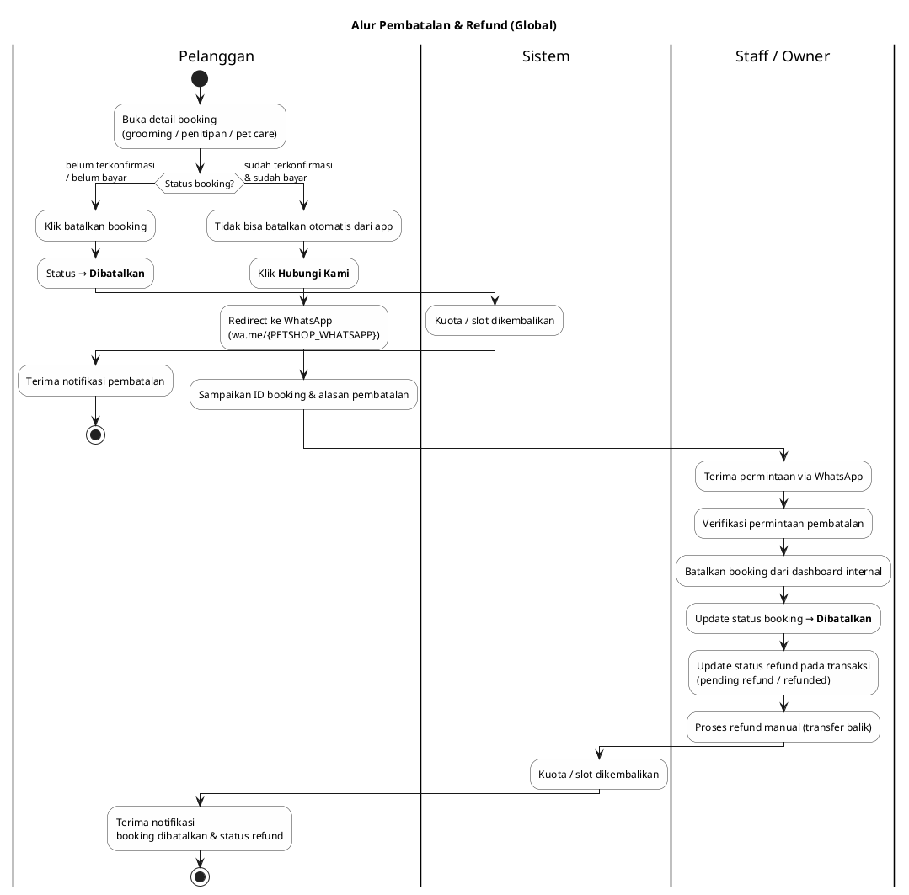
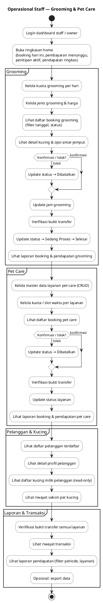
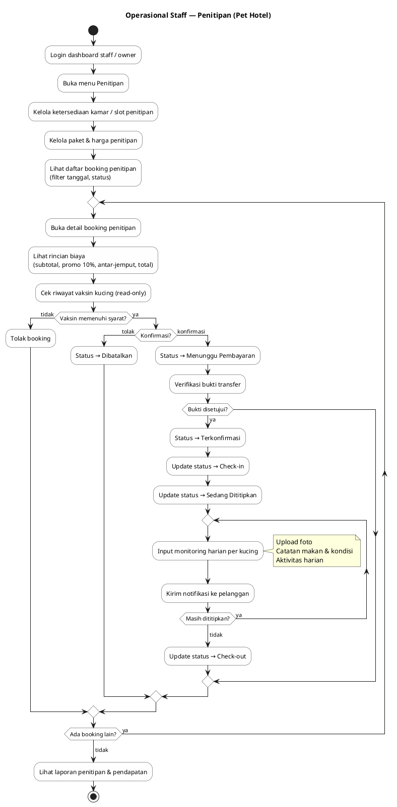
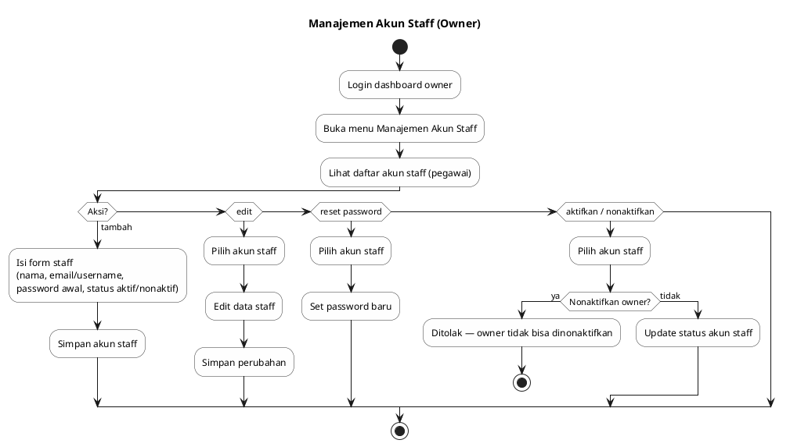

# Activity Diagram — Aplikasi Petshop

Diagram aktivitas berdasarkan [idea.md](../../idea.md).

**Swimlane / partisi utama:**
- **Pelanggan** — booking, pembayaran, pembatalan
- **Staff / Owner** — konfirmasi, verifikasi, operasional
- **Sistem** — aturan otomatis (batas waktu, kuota)

> **Preview:** Gunakan ekstensi PlantUML di VS Code/Cursor, atau render di [plantuml.com](https://www.plantuml.com/plantuml/uml).
>
> File `.puml` terpisah: `activity-autentikasi-pelanggan.puml`, `activity-data-kucing.puml`, `activity-booking-grooming.puml`, `activity-booking-penitipan.puml`, `activity-booking-petcare.puml`, `activity-pembayaran.puml`, `activity-pembatalan-refund.puml`, `activity-operasional-staff.puml`, `activity-penitipan-staff.puml`, `activity-manajemen-staff-owner.puml`

---

## 1. Autentikasi Pelanggan

Alur daftar akun, login, lupa/reset password, ubah password, dan logout.

---

## 2. Kelola Data Kucing

Alur tambah, edit, hapus kucing milik pelanggan. Hapus ditolak jika ada booking aktif.

---

## 3. Booking Grooming (End-to-End)

Alur lengkap dari ajukan booking hingga layanan selesai, termasuk antar-jemput, konfirmasi jam, dan pembayaran.

---

## 4. Booking Penitipan / Pet Hotel (End-to-End)

Alur penitipan dengan validasi vaksin, promo 10%, antar-jemput, monitoring harian, dan check-out.

---

## 5. Booking Pet Care (End-to-End)

Alur booking pet care — hanya antar sendiri, tanpa biaya antar-jemput.

---

## 6. Pembayaran & Verifikasi Bukti Transfer (Global)

Alur pembayaran transfer manual yang berlaku untuk grooming, penitipan, dan pet care.

---

## 7. Pembatalan & Refund (Global)

Dua skenario: batalkan langsung (belum terkonfirmasi) dan refund manual via WhatsApp (sudah bayar).

---

## 8. Operasional Staff — Grooming & Pet Care

Ringkasan aktivitas operasional harian staff pada grooming dan pet care.

---

## 9. Operasional Staff — Penitipan (Pet Hotel)

Aktivitas staff pada penitipan: konfirmasi, monitoring harian, check-in/check-out.

---

## 10. Manajemen Akun Staff (Owner)

Alur khusus owner untuk mengelola akun pegawai internal.

---

## Ringkasan Diagram

| No | Diagram | File `.puml` | Aktor / Swimlane |
|----|---------|--------------|------------------|
| 1 | Autentikasi Pelanggan | `activity-autentikasi-pelanggan.puml` | Pelanggan |
| 2 | Kelola Data Kucing | `activity-data-kucing.puml` | Pelanggan |
| 3 | Booking Grooming | `activity-booking-grooming.puml` | Pelanggan, Staff/Owner |
| 4 | Booking Penitipan | `activity-booking-penitipan.puml` | Pelanggan, Staff/Owner |
| 5 | Booking Pet Care | `activity-booking-petcare.puml` | Pelanggan, Staff/Owner |
| 6 | Pembayaran & Verifikasi | `activity-pembayaran.puml` | Pelanggan, Staff/Owner, Sistem |
| 7 | Pembatalan & Refund | `activity-pembatalan-refund.puml` | Pelanggan, Staff/Owner, Sistem |
| 8 | Operasional Grooming & Pet Care | `activity-operasional-staff.puml` | Staff/Owner |
| 9 | Operasional Penitipan | `activity-penitipan-staff.puml` | Staff/Owner |
| 10 | Manajemen Akun Staff | `activity-manajemen-staff-owner.puml` | Owner |
