# Class Diagram — Aplikasi Petshop

Diagram kelas berdasarkan [idea.md](../../idea.md).

**Paket utama:**
- **Akun & Pengguna** — Pelanggan, Staff, Owner
- **Data Kucing** — Kucing, Riwayat Vaksin
- **Layanan** — Grooming, Penitipan (Pet Hotel), Pet Care
- **Pembayaran** — Transaksi, Bukti Transfer, Invoice
- **Sistem** — Notifikasi

---

## 1. Diagram Overview

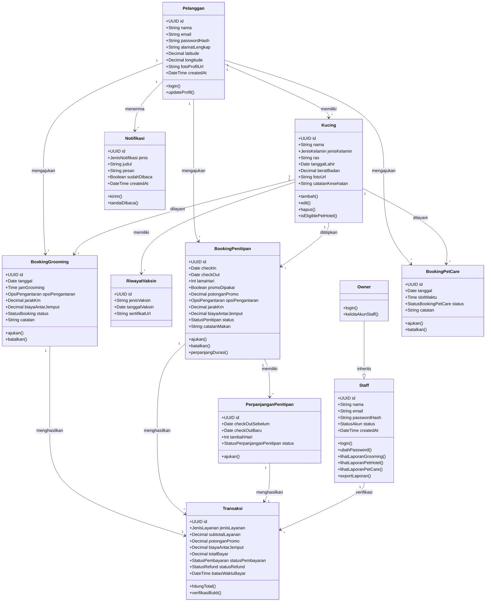

---

## 2. Akun & Pengguna

Autentikasi terpisah: akun pelanggan vs akun internal (staff/owner).

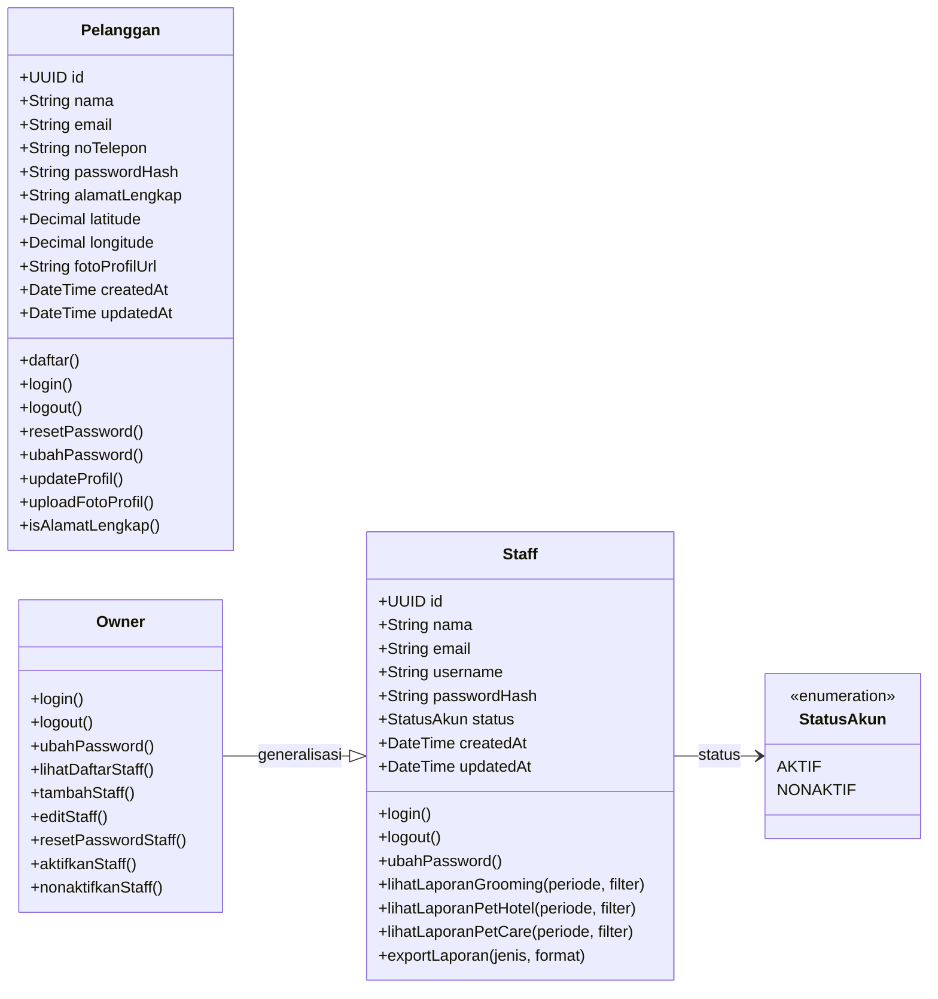

| Kelas | Keterangan |
|-------|------------|
| **Pelanggan** | Pemilik kucing; alamat wajib lengkap jika memilih antar-jemput |
| **Staff** | Pegawai operasional; tidak bisa kelola akun staff lain; akses menu Laporan (grooming, pet hotel, pet care) |
| **Owner** | Pemilik bisnis; mewarisi semua akses staff + manajemen akun staff |
| **StatusAkun** | Staff nonaktif tidak bisa login |

---

## 3. Data Kucing

Data kucing dimiliki pelanggan (`user_id`), bukan data global petshop.

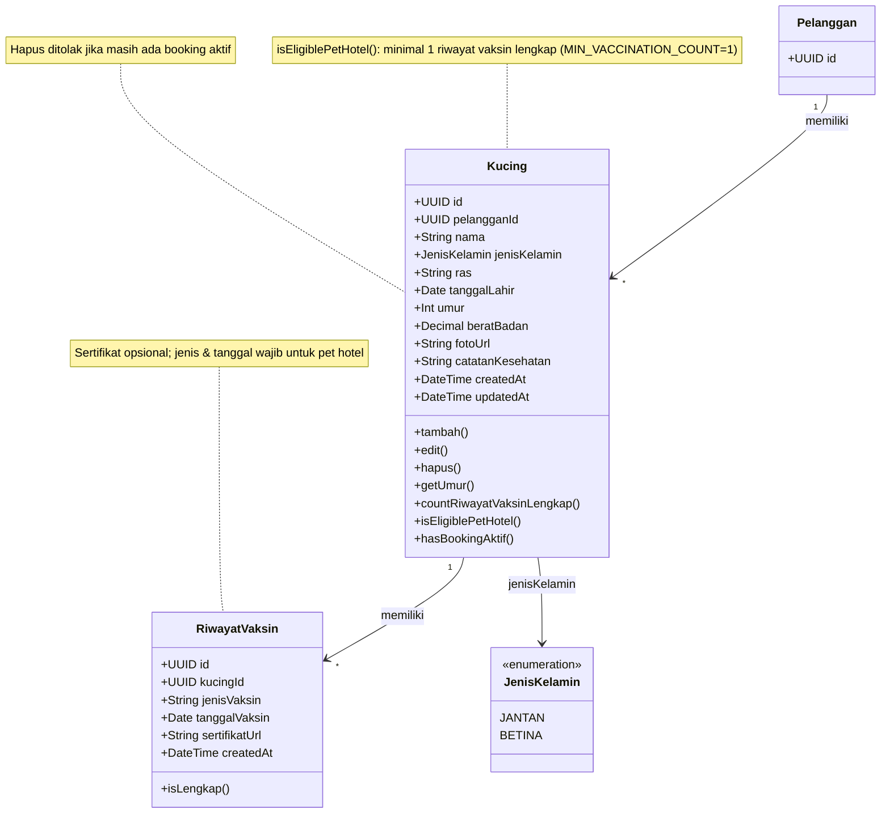

---

## 4. Master Data Layanan

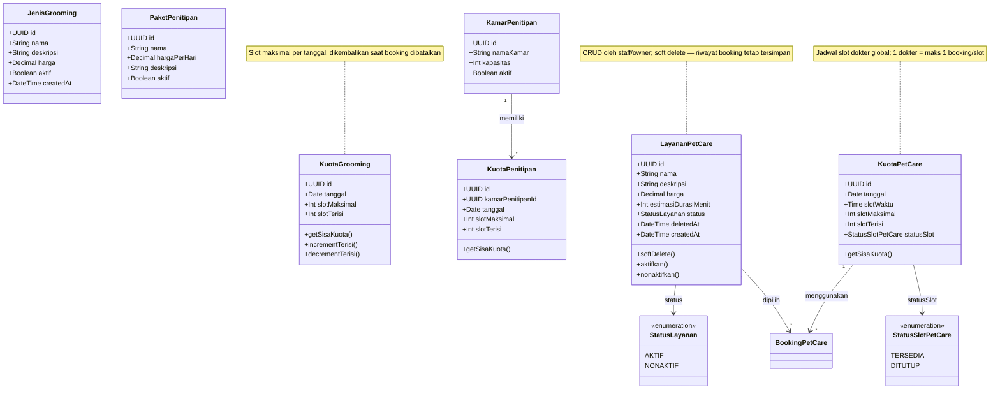

---

## 5. Booking — Grooming

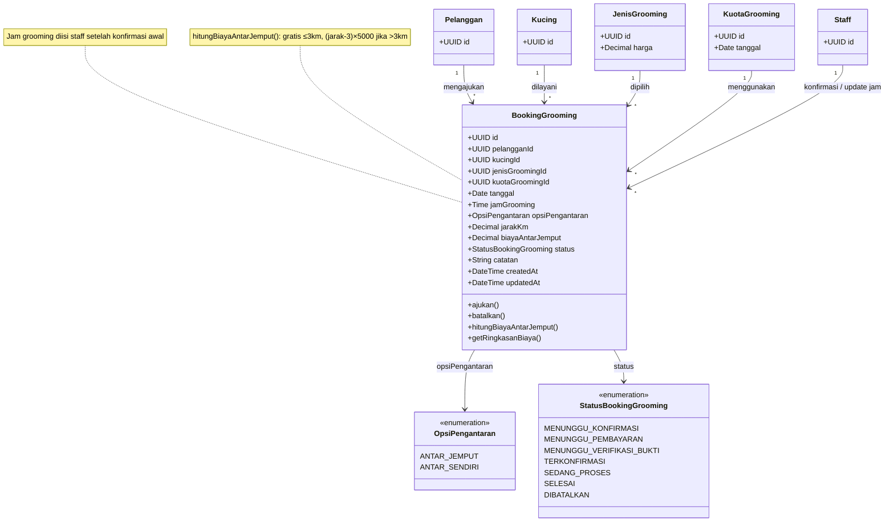

---

## 6. Booking — Penitipan (Pet Hotel)

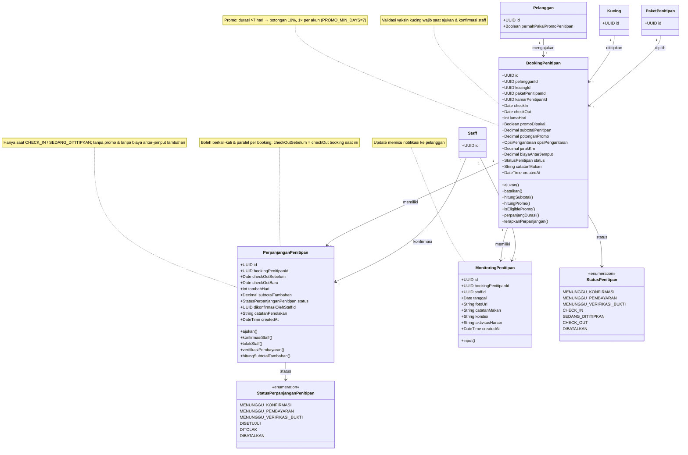

---

## 7. Booking — Pet Care

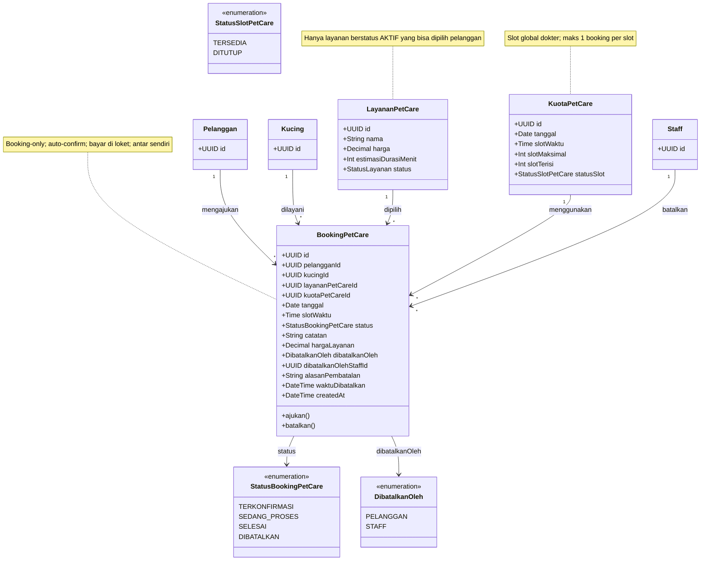

---

## 8. Pembayaran & Transaksi

Metode pembayaran: transfer bank manual (grooming & penitipan); verifikasi bukti oleh staff wajib. **Pet care dikecualikan** — bayar di loket.

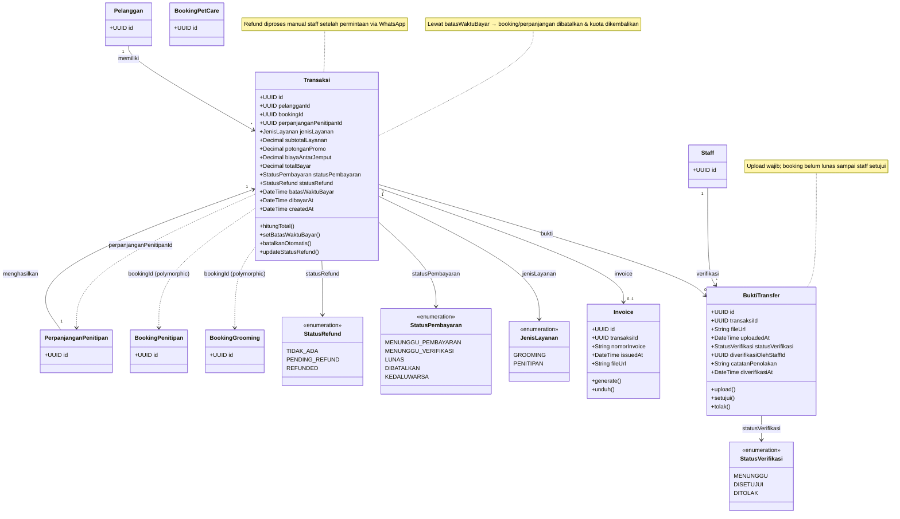

---

## 9. Layanan Antar-Jemput (Value Object / Service)

Logika antar-jemput hardcode; berlaku grooming & penitipan saja.

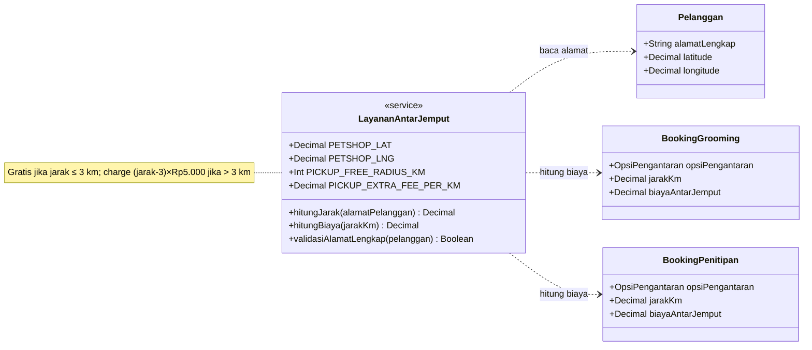

---

## 10. Notifikasi

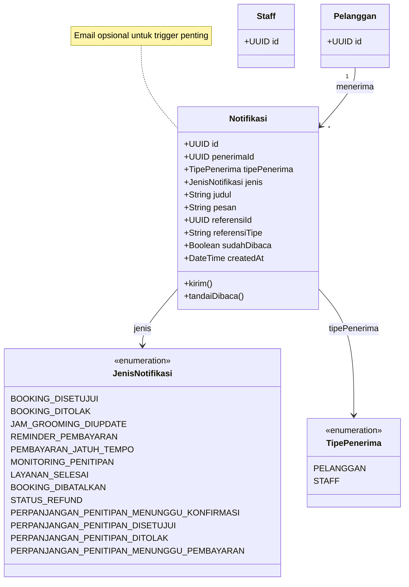

---

## 11. Relasi Antar Kelas (Ringkas)

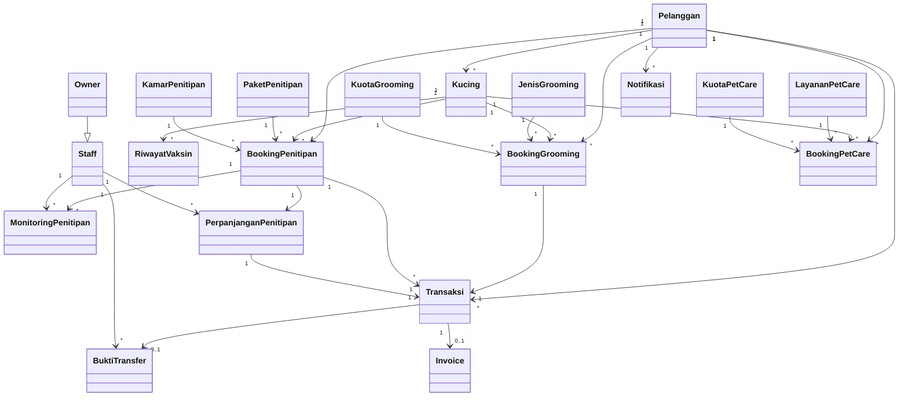

---

## 12. Daftar Kelas & Atribut Utama

| Kelas | Atribut utama | Relasi |
|-------|---------------|--------|
| **Pelanggan** | nama, email, alamat, koordinat, foto profil | 1→* Kucing, Booking, Transaksi, Notifikasi |
| **Staff** | nama, email, status akun | verifikasi BuktiTransfer, input Monitoring, lihat Laporan |
| **Owner** | — | generalisasi Staff; kelola akun Staff |
| **Kucing** | nama, ras, berat, catatan kesehatan | milik Pelanggan; 1→* RiwayatVaksin |
| **RiwayatVaksin** | jenis vaksin, tanggal, sertifikat (opsional) | milik Kucing |
| **JenisGrooming** | nama, harga | master data grooming |
| **KuotaGrooming** | tanggal, slot maksimal/terisi | kuota harian |
| **PaketPenitipan** | nama, harga per hari | master data penitipan |
| **KamarPenitipan** | nama, kapasitas | 1→* KuotaPenitipan |
| **LayananPetCare** | nama, harga, durasi, status | soft delete; CRUD staff/owner |
| **BookingGrooming** | tanggal, jam, opsi pengantaran, status | → Transaksi |
| **BookingPenitipan** | check-in/out, promo, monitoring | 1→* Transaksi, 1→* Monitoring, 1→* PerpanjanganPenitipan |
| **PerpanjanganPenitipan** | checkOutSebelum/Baru, tambahHari, subtotal | hanya CHECK_IN/SEDANG_DITITIPKAN; → Transaksi |
| **BookingPetCare** | tanggal, slot waktu, status | booking-only; auto-confirm; bayar di loket; antar sendiri |
| **Transaksi** | subtotal, promo, antar-jemput, total, refund | grooming & penitipan saja; perpanjangan = transaksi tambahan |
| **BuktiTransfer** | file, status verifikasi, catatan penolakan | wajib upload pelanggan |
| **Invoice** | nomor, file | setelah pembayaran lunas |
| **Notifikasi** | jenis, judul, pesan, sudah dibaca | trigger in-app (+ email opsional) |
| **LayananAntarJemput** | konstanta jarak & biaya | service/helper, bukan entitas DB |

---

## Catatan

| Simbol | Arti |
|--------|------|
| `--\|>` | Generalisasi / inheritance (Owner → Staff) |
| `-->` | Asosiasi / relasi |
| `..>` | Dependensi (service, polymorphic reference) |
| `<<enumeration>>` | Tipe enum |
| `<<service>>` | Kelas layanan / helper (bukan entitas persisten) |

**Konstanta hardcode (bukan kelas DB):**

| Konstanta | Nilai | Dipakai di |
|-----------|-------|------------|
| `PICKUP_FREE_RADIUS_KM` | 3 | Grooming, Penitipan |
| `PICKUP_EXTRA_FEE_PER_KM` | 5000 | Grooming, Penitipan |
| `PETSHOP_LAT`, `PETSHOP_LNG` | koordinat petshop | Hitung jarak antar-jemput |
| `MIN_VACCINATION_COUNT` | 1 | Validasi booking pet hotel |
| `PROMO_MIN_DAYS` | 7 | Promo penitipan 10% |
| `PROMO_DISCOUNT_PERCENT` | 10 | Promo penitipan |
| `PETSHOP_WHATSAPP` | nomor WA | Link Hubungi Kami (refund manual) |
| Rekening bank petshop | bank, no rekening, atas nama | Halaman transfer manual |

**Aturan bisnis penting:**
- Setiap booking awal (grooming, penitipan) menghasilkan **1 Transaksi**; **pet care tidak ada transaksi** (bayar di loket).
- Setiap **perpanjangan penitipan** disetujui = transaksi tambahan terpisah.
- **Perpanjangan penitipan** hanya saat `CHECK_IN` / `SEDANG_DITITIPKAN`; tanpa promo & biaya antar-jemput tambahan; boleh berkali-kali & paralel per booking.
- **Antar-jemput** hanya pada grooming & penitipan; pet care **antar sendiri** fixed.
- **Pembatalan** sebelum konfirmasi: pelanggan batalkan langsung; setelah bayar: via WhatsApp + proses staff.
- **Kuota** grooming & penitipan dikembalikan otomatis saat booking dibatalkan atau kedaluwarsa; **pet care** slot dokter dikembalikan saat booking dibatalkan (pelanggan/staff).
