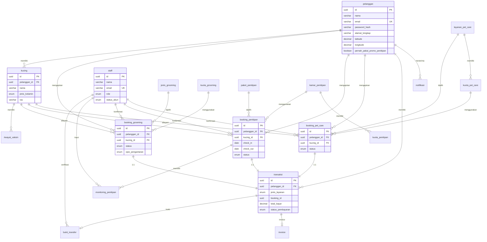
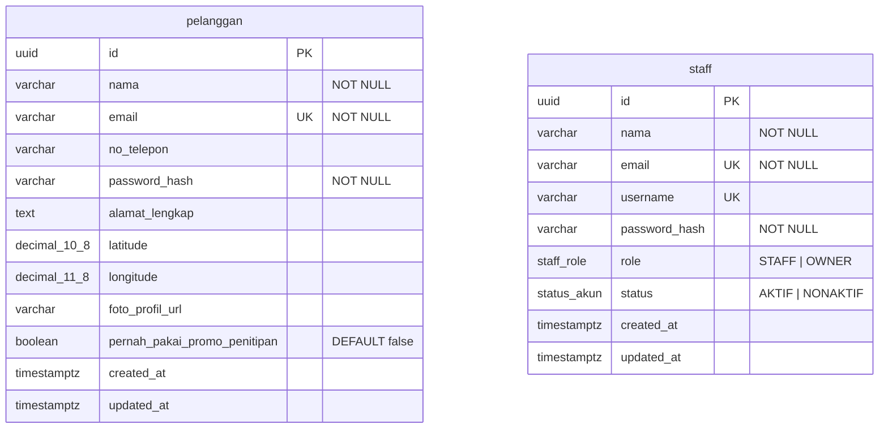
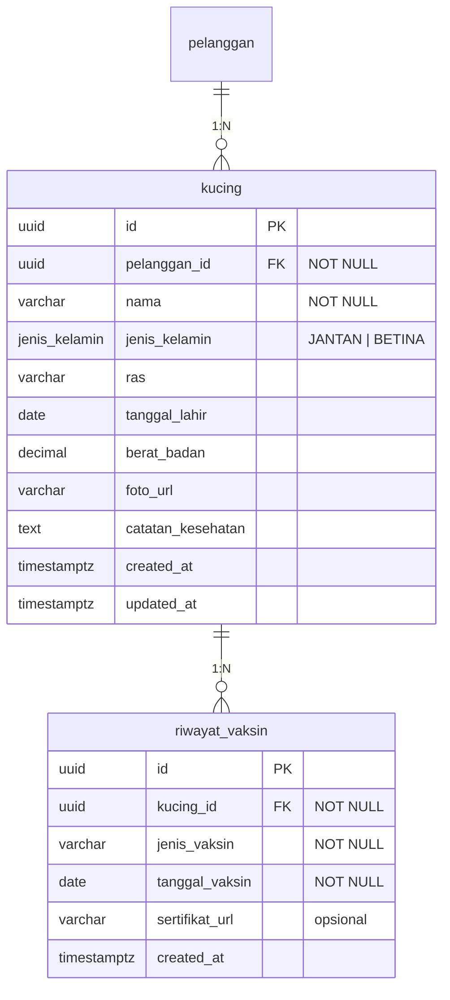
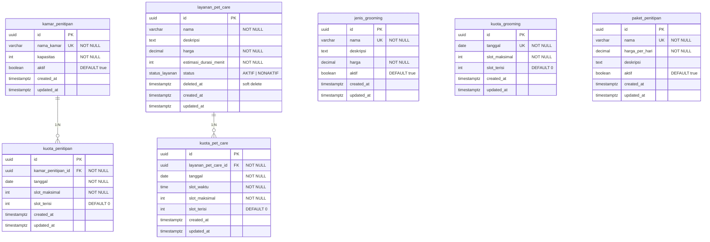
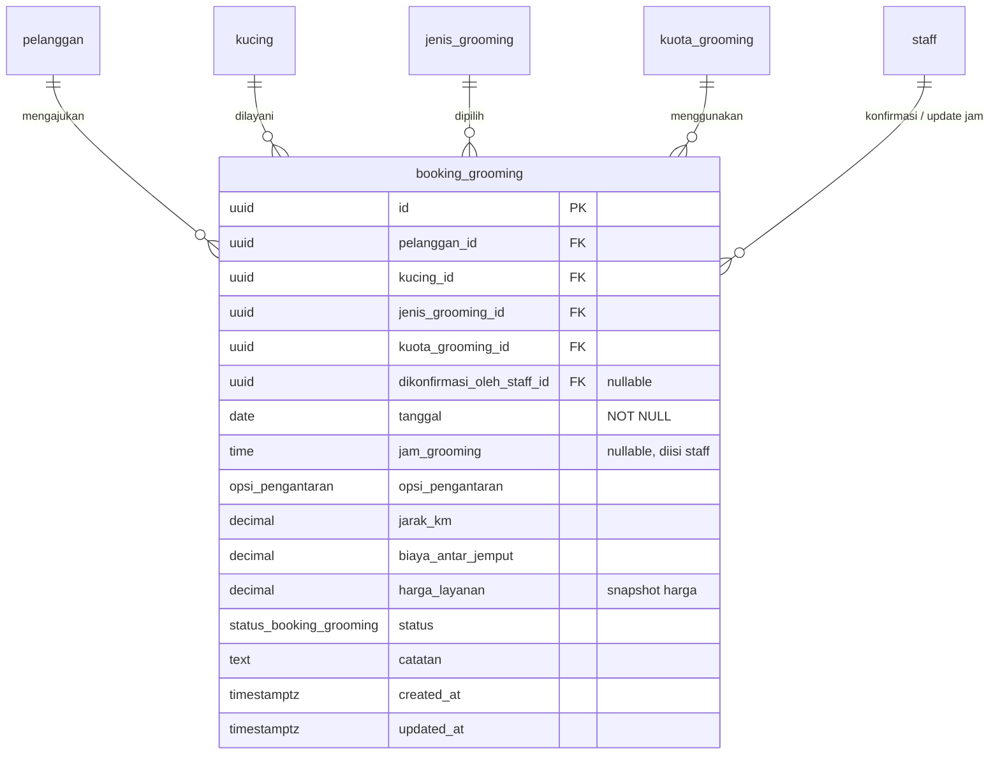
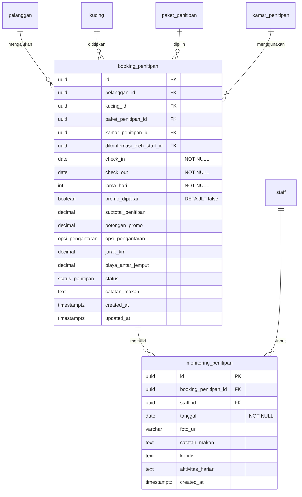
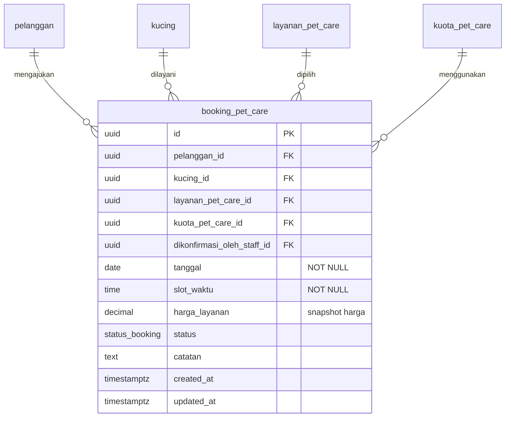
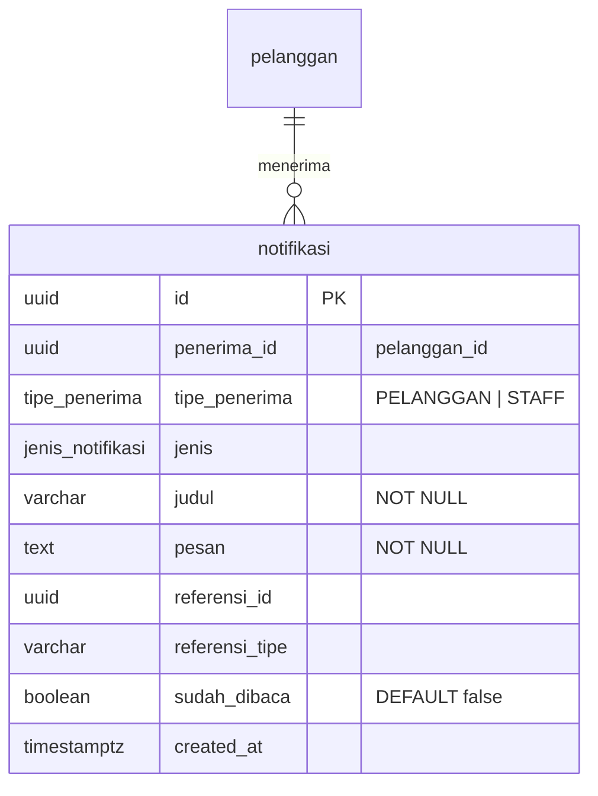
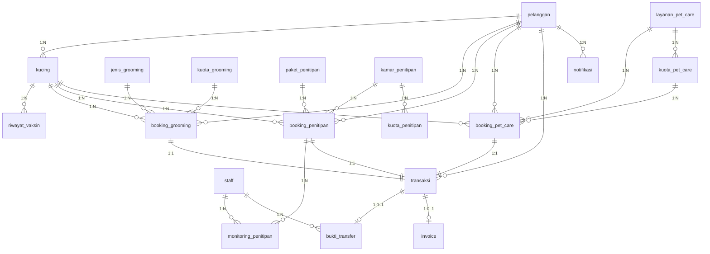

# ERD — Aplikasi Petshop

Entity Relationship Diagram berdasarkan [idea.md](../../idea.md) dan [class diagram](../class/class-diagram.md).

**Database:** PostgreSQL  
**Konvensi penamaan:** `snake_case`, tabel jamak, PK `UUID`, timestamp `created_at` / `updated_at`

---

## 1. ERD Overview



---

## 2. Modul Akun & Pengguna



| Entitas | Keterangan |
|---------|------------|
| **pelanggan** | Akun pelanggan; autentikasi terpisah dari staff/owner |
| **staff** | Akun internal; kolom `role = OWNER` untuk pemilik bisnis (generalisasi Owner → Staff) |

---

## 3. Modul Data Kucing



**Aturan:**
- `kucing.pelanggan_id` → data kucing milik pelanggan, bukan global petshop
- Hapus kucing ditolak jika masih ada booking aktif (dicek di aplikasi)
- Pet hotel: minimal 1 `riwayat_vaksin` dengan `jenis_vaksin` & `tanggal_vaksin` terisi

---

## 4. Modul Master Data Layanan



| Entitas | Keterangan |
|---------|------------|
| **jenis_grooming** | Master jenis grooming & harga (lengkap, jamur, kutu, dll.) |
| **kuota_grooming** | Slot maksimal per tanggal; `slot_terisi` naik/turun saat booking |
| **paket_penitipan** | Harga per hari penitipan |
| **kamar_penitipan** + **kuota_penitipan** | Kamar & ketersediaan slot per tanggal |
| **layanan_pet_care** | CRUD staff/owner; soft delete via `deleted_at` |

---

## 5. Modul Booking

### 5a. Booking Grooming



### 5b. Booking Penitipan (Pet Hotel)



### 5c. Booking Pet Care



**Catatan booking:**
- Pet care **tidak** punya `opsi_pengantaran` (selalu antar sendiri)
- Grooming & penitipan menyimpan snapshot `jarak_km` & `biaya_antar_jemput`
- Harga layanan di-snapshot saat booking agar perubahan master data tidak mengubah riwayat

---

## 6. Modul Pembayaran & Transaksi

```mermaid
erDiagram
    pelanggan ||--o{ transaksi : memiliki
    transaksi ||--o| bukti_transfer : "0..1"
    transaksi ||--o| invoice : "0..1"
    staff ||--o{ bukti_transfer : verifikasi

    transaksi {
        uuid id PK
        uuid pelanggan_id FK
        jenis_layanan jenis_layanan "GROOMING | PENITIPAN | PET_CARE"
        uuid booking_id "polymorphic ref"
        decimal subtotal_layanan
        decimal potongan_promo
        decimal biaya_antar_jemput
        decimal total_bayar
        status_pembayaran status_pembayaran
        status_refund status_refund
        timestamptz batas_waktu_bayar
        timestamptz dibayar_at
        timestamptz created_at
        timestamptz updated_at
    }

    bukti_transfer {
        uuid id PK
        uuid transaksi_id FK UK
        varchar file_url "NOT NULL"
        status_verifikasi status_verifikasi
        uuid diverifikasi_oleh_staff_id FK
        text catatan_penolakan
        timestamptz uploaded_at
        timestamptz diverifikasi_at
    }

    invoice {
        uuid id PK
        uuid transaksi_id FK UK
        varchar nomor_invoice UK
        varchar file_url
        timestamptz issued_at
    }
```

**Relasi polymorphic:** `transaksi.jenis_layanan` + `transaksi.booking_id` merujuk ke tabel booking yang sesuai. Unique index `(jenis_layanan, booking_id)` menjamin 1 transaksi per booking.

---

## 7. Modul Notifikasi



---

## 8. Diagram Relasi Lengkap (Cardinality)



---

## 9. Daftar Tabel & Relasi

| No | Tabel | PK | FK utama | Relasi |
|----|-------|----|---------|----|
| 1 | `pelanggan` | id | — | 1→N kucing, booking, transaksi, notifikasi |
| 2 | `staff` | id | — | 1→N bukti_transfer, monitoring, konfirmasi booking |
| 3 | `kucing` | id | pelanggan_id | 1→N riwayat_vaksin, booking |
| 4 | `riwayat_vaksin` | id | kucing_id | N→1 kucing |
| 5 | `jenis_grooming` | id | — | 1→N booking_grooming |
| 6 | `kuota_grooming` | id | — | 1→N booking_grooming |
| 7 | `paket_penitipan` | id | — | 1→N booking_penitipan |
| 8 | `kamar_penitipan` | id | — | 1→N kuota_penitipan, booking_penitipan |
| 9 | `kuota_penitipan` | id | kamar_penitipan_id | N→1 kamar |
| 10 | `layanan_pet_care` | id | — | 1→N kuota_pet_care, booking_pet_care |
| 11 | `kuota_pet_care` | id | layanan_pet_care_id | N→1 layanan |
| 12 | `booking_grooming` | id | pelanggan, kucing, jenis, kuota | 1→1 transaksi |
| 13 | `booking_penitipan` | id | pelanggan, kucing, paket, kamar | 1→1 transaksi, 1→N monitoring |
| 14 | `monitoring_penitipan` | id | booking_penitipan_id, staff_id | N→1 booking |
| 15 | `booking_pet_care` | id | pelanggan, kucing, layanan, kuota | 1→1 transaksi |
| 16 | `transaksi` | id | pelanggan_id | 1→0..1 bukti_transfer, invoice |
| 17 | `bukti_transfer` | id | transaksi_id, staff_id | N→1 transaksi |
| 18 | `invoice` | id | transaksi_id | N→1 transaksi |
| 19 | `notifikasi` | id | penerima_id | N→1 pelanggan/staff |

**Total: 19 tabel**

---

## 10. Enum & Konstanta

### Enum di database

| Enum | Nilai |
|------|-------|
| `staff_role` | `STAFF`, `OWNER` |
| `status_akun` | `AKTIF`, `NONAKTIF` |
| `jenis_kelamin` | `JANTAN`, `BETINA` |
| `opsi_pengantaran` | `ANTAR_JEMPUT`, `ANTAR_SENDIRI` |
| `status_booking_grooming` | `MENUNGGU_KONFIRMASI`, `MENUNGGU_PEMBAYARAN`, `MENUNGGU_VERIFIKASI_BUKTI`, `TERKONFIRMASI`, `SEDANG_PROSES`, `SELESAI`, `DIBATALKAN` |
| `status_penitipan` | `MENUNGGU_KONFIRMASI`, `MENUNGGU_PEMBAYARAN`, `MENUNGGU_VERIFIKASI_BUKTI`, `CHECK_IN`, `SEDANG_DITITIPKAN`, `CHECK_OUT`, `DIBATALKAN` |
| `status_booking` | `MENUNGGU_KONFIRMASI`, `MENUNGGU_PEMBAYARAN`, `MENUNGGU_VERIFIKASI_BUKTI`, `TERKONFIRMASI`, `SEDANG_PROSES`, `SELESAI`, `DIBATALKAN` |
| `status_layanan` | `AKTIF`, `NONAKTIF` |
| `jenis_layanan` | `GROOMING`, `PENITIPAN`, `PET_CARE` |
| `status_pembayaran` | `MENUNGGU_PEMBAYARAN`, `MENUNGGU_VERIFIKASI`, `LUNAS`, `DIBATALKAN`, `KEDALUWARSA` |
| `status_verifikasi` | `MENUNGGU`, `DISETUJUI`, `DITOLAK` |
| `status_refund` | `TIDAK_ADA`, `PENDING_REFUND`, `REFUNDED` |
| `tipe_penerima` | `PELANGGAN`, `STAFF` |
| `jenis_notifikasi` | `BOOKING_DISETUJUI`, `BOOKING_DITOLAK`, `JAM_GROOMING_DIUPDATE`, `REMINDER_PEMBAYARAN`, `PEMBAYARAN_JATUH_TEMPO`, `MONITORING_PENITIPAN`, `LAYANAN_SELESAI`, `BOOKING_DIBATALKAN`, `STATUS_REFUND` |

### Konstanta hardcode (bukan tabel)

| Konstanta | Nilai | Dipakai di |
|-----------|-------|------------|
| `PICKUP_FREE_RADIUS_KM` | 3 | Grooming, Penitipan |
| `PICKUP_EXTRA_FEE_PER_KM` | 5000 | Grooming, Penitipan |
| `PETSHOP_LAT`, `PETSHOP_LNG` | koordinat | Hitung jarak |
| `MIN_VACCINATION_COUNT` | 1 | Validasi pet hotel |
| `PROMO_MIN_DAYS` | 7 | Promo penitipan |
| `PROMO_DISCOUNT_PERCENT` | 10 | Promo penitipan |
| `PETSHOP_WHATSAPP` | nomor WA | Hubungi Kami |
| Rekening bank | hardcode app | Transfer manual |

---

## 11. Index Penting

| Tabel | Index | Alasan |
|-------|-------|--------|
| `pelanggan` | `email` UNIQUE | Login |
| `staff` | `email`, `username` UNIQUE | Login |
| `kucing` | `pelanggan_id` | Daftar kucing per pelanggan |
| `riwayat_vaksin` | `kucing_id` | Cek syarat vaksin |
| `kuota_grooming` | `tanggal` UNIQUE | Kuota harian |
| `kuota_penitipan` | `(kamar_penitipan_id, tanggal)` UNIQUE | Kuota per kamar per hari |
| `kuota_pet_care` | `(layanan_pet_care_id, tanggal, slot_waktu)` UNIQUE | Slot unik |
| `booking_*` | `pelanggan_id`, `status`, `tanggal/check_in` | Filter dashboard |
| `transaksi` | `(jenis_layanan, booking_id)` UNIQUE | 1 transaksi per booking |
| `transaksi` | `pelanggan_id`, `status_pembayaran` | Tagihan menunggu |
| `notifikasi` | `(penerima_id, sudah_dibaca)` | Pusat notifikasi |

---

## File terkait

- Skema SQL implementasi: [database/schema.sql](../../database/schema.sql)
- LRS (Logical Record Structure): [database/lrs.md](../../database/lrs.md)
- Class diagram: [class-diagram.md](../class/class-diagram.md)
