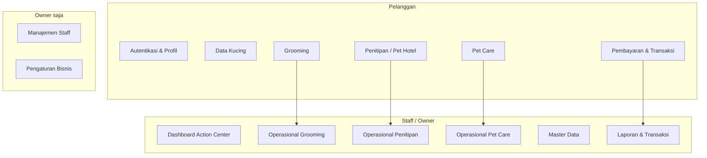
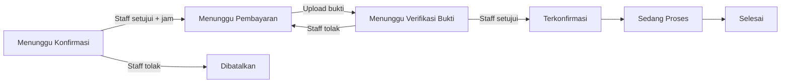
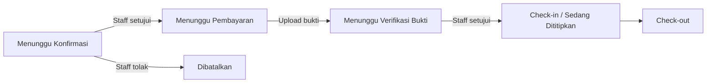
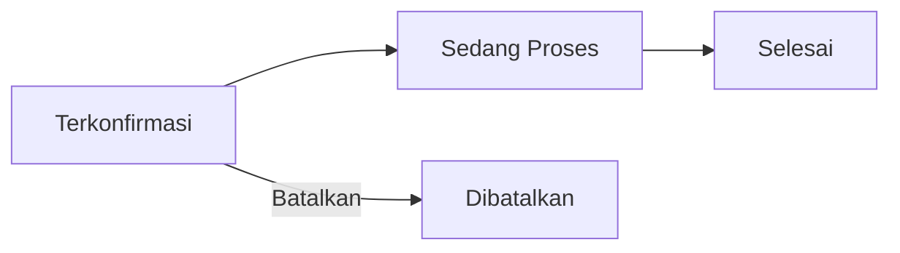
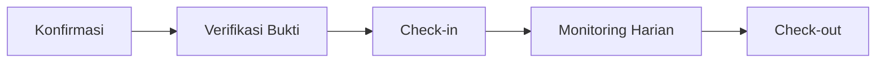
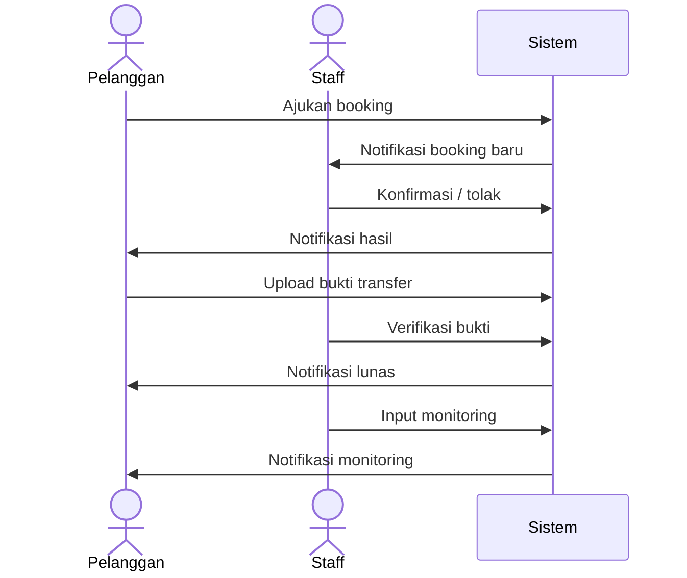

# Daftar Semua Flow Aplikasi Pet Hotel

Dokumen indeks **seluruh alur (flow) bisnis** aplikasi petshop, dikelompokkan berdasarkan aktor yang menjalankannya.

| Aktor | Peran | Entry point |
|-------|-------|-------------|
| **Pelanggan** | Pemilik kucing / pengguna layanan | `/login`, `/dashboard` |
| **Staff** | Pegawai operasional harian | `/admin/login`, `/admin/dashboard` |
| **Owner** | Pemilik bisnis; mewarisi semua akses Staff + fitur khusus | `/admin/login`, `/admin/dashboard` |

> **Legenda dokumen detail:** Flow yang sudah punya dokumentasi langkah-demi-langkah ada link ke file terpisah di folder [`diagrams/flow/`](./). Diagram UML lebih lengkap ada di [`diagrams/usecase/`](../usecase/), [`diagrams/activity/`](../activity/), dan [`diagrams/sequence/`](../sequence/).

---

## Peta Modul Layanan

---

# Bagian 1 — Flow Pelanggan

Semua route di bawah memerlukan login pelanggan kecuali autentikasi (daftar/login/lupa password).

---

## 1.1 Autentikasi & Keamanan Akun

| # | Flow | Trigger | Langkah singkat | Route utama |
|---|------|---------|-----------------|-------------|
| P-A1 | **Daftar akun** | Pelanggan baru | Isi nama, email, password → akun tersimpan → redirect login/dashboard | `GET/POST /register` |
| P-A2 | **Login** | Sudah punya akun | Email + password → sesi aktif → dashboard | `GET/POST /login` |
| P-A3 | **Logout** | Pelanggan keluar | Hapus sesi → halaman login | `POST /logout` |
| P-A4 | **Lupa password** | Lupa password | Email → link reset → set password baru | `GET/POST /forgot-password`, `/reset-password` |
| P-A5 | **Ubah password** | Sudah login | Password lama + baru → update | `GET/POST /change-password` |

**Diagram terkait:** [`activity-autentikasi-pelanggan.puml`](../activity/activity-autentikasi-pelanggan.puml), [`sequence-autentikasi-pelanggan.puml`](../sequence/sequence-autentikasi-pelanggan.puml)

---

## 1.2 Profil Pelanggan

| # | Flow | Trigger | Langkah singkat | Route utama |
|---|------|---------|-----------------|-------------|
| P-B1 | **Lihat & edit profil** | Menu profil | Update nama, telepon, alamat lengkap, koordinat | `GET/POST /profil` |
| P-B2 | **Geocode alamat** | Isi/edit alamat | Sistem bantu konversi alamat → koordinat (untuk antar-jemput) | `GET /profil/geocode` |

> Alamat lengkap **wajib** jika pelanggan memilih opsi antar-jemput pada grooming atau penitipan.

---

## 1.3 Kelola Data Kucing

| # | Flow | Trigger | Langkah singkat | Route utama |
|---|------|---------|-----------------|-------------|
| P-C1 | **Lihat daftar kucing** | Menu Kucing Saya | Daftar semua kucing milik akun | `GET /kucing` |
| P-C2 | **Tambah kucing** | Tombol tambah | Form data kucing + opsional riwayat vaksin | `GET /kucing/tambah`, `POST /kucing` |
| P-C3 | **Edit kucing** | Pilih kucing | Update data & riwayat vaksin | `GET /kucing/edit`, `POST /kucing/update` |
| P-C4 | **Hapus kucing** | Tombol hapus | Ditolak jika ada booking aktif; else hapus | `POST /kucing/hapus` |

**Prasyarat layanan:** Minimal **1 kucing terdaftar** untuk booking grooming, penitipan, dan pet care.

**Diagram terkait:** [`activity-data-kucing.puml`](../activity/activity-data-kucing.puml), [`sequence-data-kucing.puml`](../sequence/sequence-data-kucing.puml)

---

## 1.4 Dashboard Pelanggan

| # | Flow | Trigger | Langkah singkat | Route utama |
|---|------|---------|-----------------|-------------|
| P-D1 | **Ringkasan home** | Setelah login | Shortcut ke layanan, ringkasan aktivitas | `GET /dashboard` |
| P-D2 | **Pusat notifikasi** | Icon notifikasi | Daftar notifikasi in-app | `GET /notifikasi` |
| P-D3 | **Riwayat transaksi** | Menu transaksi | Semua tagihan & status pembayaran | `GET /transaksi` |
| P-D4 | **Bantuan** | Menu bantuan | Info kontak / panduan | `GET /bantuan` |

---

## 1.5 Flow Grooming (Pelanggan)

| # | Flow | Trigger | Status booking (utama) | Route utama |
|---|------|---------|------------------------|-------------|
| P-G1 | **Lihat layanan & kuota** | Menu Grooming | — | `GET /grooming` |
| P-G2 | **Ajukan booking grooming** | Form booking | → `MENUNGGU_KONFIRMASI` | `GET/POST /grooming/booking` |
| P-G3 | **Estimasi pickup (antar-jemput)** | Pilih opsi antar | Hitung jarak & biaya | `GET /grooming/estimasi-pickup` |
| P-G4 | **Bayar & upload bukti** | Setelah staff konfirmasi jam | → `MENUNGGU_VERIFIKASI_BUKTI` | `GET/POST /grooming/pembayaran` |
| P-G5 | **Lihat detail booking** | Dari riwayat | — | `GET /grooming/detail` |
| P-G6 | **Riwayat grooming** | Menu riwayat | — | `GET /grooming/riwayat` |
| P-G7 | **Unduh invoice** | Setelah lunas | — | `GET /grooming/invoice` |
| P-G8 | **Batalkan booking** | Sebelum/sesudah konfirmasi | → `DIBATALKAN` atau via WhatsApp | `POST /grooming/booking/batalkan` |

**Alur status grooming:**

**Diagram terkait:** [`activity-booking-grooming.puml`](../activity/activity-booking-grooming.puml), [`sequence-booking-grooming.puml`](../sequence/sequence-booking-grooming.puml)

---

## 1.6 Flow Penitipan / Pet Hotel (Pelanggan)

| # | Flow | Trigger | Status booking (utama) | Route utama |
|---|------|---------|------------------------|-------------|
| P-P1 | **Lihat paket penitipan** | Menu Penitipan | — | `GET /penitipan` |
| P-P2 | **Ajukan booking penitipan** | Form booking | → `MENUNGGU_KONFIRMASI` | `GET/POST /penitipan/booking` |
| P-P3 | **Estimasi biaya & promo** | Isi tanggal | Promo 10% jika >7 hari & belum pernah pakai | `GET /penitipan/estimasi-biaya` |
| P-P4 | **Estimasi pickup** | Opsi antar-jemput | Hitung jarak & biaya | `GET /penitipan/estimasi-pickup` |
| P-P5 | **Bayar & upload bukti** | Setelah staff konfirmasi | → `MENUNGGU_VERIFIKASI_BUKTI` | `GET/POST /penitipan/pembayaran` |
| P-P6 | **Lihat detail & monitoring** | Dari riwayat | Lihat riwayat monitoring harian staff | `GET /penitipan/detail` |
| P-P7 | **Riwayat penitipan** | Menu riwayat | — | `GET /penitipan/riwayat` |
| P-P8 | **Unduh invoice** | Setelah lunas | — | `GET /penitipan/invoice` |
| P-P9 | **Batalkan penitipan** | Sebelum/sesudah konfirmasi | → `DIBATALKAN` atau via WhatsApp | `POST /penitipan/booking/batalkan` |

**Prasyarat:** Riwayat vaksin kucing **minimal 1 entri** (jenis + tanggal).

**Alur status penitipan (sisi pelanggan):**

**Diagram terkait:** [`activity-booking-penitipan.puml`](../activity/activity-booking-penitipan.puml), [`sequence-booking-penitipan.puml`](../sequence/sequence-booking-penitipan.puml)

---

## 1.7 Perpanjangan Penitipan (Pelanggan)

| # | Flow | Trigger | Status perpanjangan | Route utama |
|---|------|---------|---------------------|-------------|
| P-PP1 | **Estimasi perpanjangan** | Detail penitipan aktif | — | `GET /penitipan/perpanjangan/estimasi` |
| P-PP2 | **Ajukan perpanjangan** | Check-out baru > saat ini | → `MENUNGGU_KONFIRMASI` | `POST /penitipan/perpanjangan` |
| P-PP3 | **Bayar perpanjangan** | Setelah staff setujui | → `MENUNGGU_VERIFIKASI_BUKTI` | `GET/POST /penitipan/perpanjangan/pembayaran` |

**Prasyarat:** Booking status `CHECK_IN` atau `SEDANG_DITITIPKAN`. Boleh diajukan berkali-kali selama belum check-out.

**Diagram terkait:** [`activity-perpanjangan-penitipan.puml`](../activity/activity-perpanjangan-penitipan.puml), [`sequence-perpanjangan-penitipan.puml`](../sequence/sequence-perpanjangan-penitipan.puml)

---

## 1.8 Flow Pet Care (Pelanggan)

| # | Flow | Trigger | Status booking | Route utama |
|---|------|---------|----------------|-------------|
| P-PC1 | **Lihat layanan pet care** | Menu Pet Care | — | `GET /pet-care` |
| P-PC2 | **Ajukan booking pet care** | Pilih slot + layanan + kucing | → `TERKONFIRMASI` (auto) | `GET/POST /pet-care/booking` |
| P-PC3 | **Riwayat pet care** | Menu riwayat | — | `GET /pet-care/riwayat` |
| P-PC4 | **Batalkan booking** | Kapan saja termasuk hari-H | → `DIBATALKAN` | `POST /pet-care/booking/batalkan` |

**Catatan:** Pet care **booking-only** — tidak ada pembayaran di app (bayar di loket), tidak ada antar-jemput.

**Alur status pet care:**

**Diagram terkait:** [`activity-booking-petcare.puml`](../activity/activity-booking-petcare.puml), [`sequence-booking-petcare.puml`](../sequence/sequence-booking-petcare.puml)

---

## 1.9 Pembayaran & Transaksi (Pelanggan)

| # | Flow | Berlaku untuk | Langkah singkat |
|---|------|---------------|-----------------|
| P-T1 | **Lihat tagihan menunggu** | Grooming & Penitipan | Daftar transaksi status menunggu bayar/verifikasi |
| P-T2 | **Transfer bank manual** | Grooming & Penitipan | Transfer ke rekening petshop |
| P-T3 | **Upload bukti transfer** | Grooming & Penitipan | Wajib sebelum submit; status → menunggu verifikasi |
| P-T4 | **Unduh invoice/struk** | Setelah lunas | PDF/detail invoice per booking |
| P-T5 | **Kedaluwarsa otomatis** | Grooming & Penitipan | Sistem batalkan jika lewat batas waktu bayar |

**Diagram terkait:** [`activity-pembayaran.puml`](../activity/activity-pembayaran.puml), [`sequence-pembayaran.puml`](../sequence/sequence-pembayaran.puml)

---

## 1.10 Pembatalan & Refund (Pelanggan)

| # | Flow | Kondisi | Hasil |
|---|------|---------|-------|
| P-R1 | **Batalkan langsung** | Belum terkonfirmasi / belum bayar | Status `DIBATALKAN`, kuota dikembalikan |
| P-R2 | **Hubungi WhatsApp** | Sudah bayar & terkonfirmasi | Staff proses pembatalan & refund manual |

**Diagram terkait:** [`activity-pembatalan-refund.puml`](../activity/activity-pembatalan-refund.puml), [`sequence-pembatalan-refund.puml`](../sequence/sequence-pembatalan-refund.puml)

---

# Bagian 2 — Flow Admin / Staff

Semua route di bawah prefiks `/admin/*` memerlukan login staff. Route bertanda **(Owner)** memerlukan role Owner.

---

## 2.1 Autentikasi Staff

| # | Flow | Route utama |
|---|------|-------------|
| S-A1 | Login staff/owner | `GET/POST /admin/login` |
| S-A2 | Logout | `POST /admin/logout` |
| S-A3 | Lupa / reset password | `GET/POST /admin/forgot-password`, `/admin/reset-password` |
| S-A4 | Ubah password | `GET/POST /admin/change-password` |

**Diagram terkait:** [`sequence-autentikasi-staff.puml`](../sequence/sequence-autentikasi-staff.puml)

---

## 2.2 Dashboard & Action Center

| # | Flow | Isi widget / KPI | Route |
|---|------|------------------|-------|
| S-D1 | **Ringkasan operasional** | Booking hari ini, verifikasi pending, penitipan aktif, pendapatan | `GET /admin/dashboard` |
| S-D2 | **Action Center — Konfirmasi penitipan** | Booking menunggu konfirmasi + preview | → `/admin/penitipan/booking?status=MENUNGGU_KONFIRMASI` |
| S-D3 | **Action Center — Verifikasi bukti** | Bukti grooming & penitipan menunggu | → `/admin/grooming/pembayaran`, `/admin/penitipan/pembayaran` |
| S-D4 | **Action Center — Monitoring belum diinput** | Kucing aktif tanpa monitoring hari ini | → `/admin/penitipan/booking?status=SEDANG_DITITIPKAN&monitoring=belum_input` |
| S-D5 | **Pusat notifikasi staff** | Notifikasi operasional | `GET /admin/notifikasi` |

---

## 2.3 Operasional Grooming (Staff)

| # | Flow | Route utama |
|---|------|-------------|
| S-G1 | Kelola jenis layanan grooming (CRUD) | `/admin/grooming/layanan/*` |
| S-G2 | Kelola kuota grooming per hari (CRUD) | `/admin/grooming/kuota/*` |
| S-G3 | Lihat daftar booking grooming | `GET /admin/grooming/booking` |
| S-G4 | **Konfirmasi booking** (+ set jam) | `POST /admin/grooming/booking/konfirmasi` |
| S-G5 | **Tolak booking** | `POST /admin/grooming/booking/tolak` |
| S-G6 | Update status layanan (proses/selesai) | `POST /admin/grooming/booking/status` |
| S-G7 | **Verifikasi bukti transfer** | `GET /admin/grooming/pembayaran`, `POST .../setujui`, `POST .../tolak` |
| S-G8 | Batalkan + refund (internal) | `POST /admin/grooming/booking/batalkan-refund` |
| S-G9 | Tandai refund selesai | `POST /admin/grooming/transaksi/refund-selesai` |

---

## 2.4 Operasional Penitipan (Staff)

| # | Flow | Route utama | Dokumen detail |
|---|------|-------------|----------------|
| S-P1 | Lihat daftar booking penitipan | `GET /admin/penitipan/booking` | — |
| S-P2 | **Konfirmasi booking penitipan** | `POST /admin/penitipan/booking/konfirmasi` | [`flow-konfirmasi-penitipan-admin.md`](./flow-konfirmasi-penitipan-admin.md) |
| S-P3 | **Tolak booking penitipan** | `POST /admin/penitipan/booking/tolak` | [`flow-konfirmasi-penitipan-admin.md`](./flow-konfirmasi-penitipan-admin.md) |
| S-P4 | **Verifikasi bukti transfer** | `GET /admin/penitipan/pembayaran` | [`flow-verifikasi-bukti-penitipan-admin.md`](./flow-verifikasi-bukti-penitipan-admin.md) |
| S-P5 | **Check-in (1 klik)** | `POST /admin/penitipan/booking/check-in` | [`flow-monitoring-penitipan-admin.md`](./flow-monitoring-penitipan-admin.md) |
| S-P6 | Update status operasional (legacy check-in → aktif, check-out) | `POST /admin/penitipan/booking/status` | [`flow-monitoring-penitipan-admin.md`](./flow-monitoring-penitipan-admin.md) |
| S-P7 | **Input monitoring harian** | `GET/POST /admin/penitipan/monitoring/tambah` | [`flow-monitoring-penitipan-admin.md`](./flow-monitoring-penitipan-admin.md) |
| S-P8 | **Lihat riwayat monitoring** | `.../monitoring/tambah?tab=riwayat` | [`flow-melihat-laporan-kucing-admin.md`](./flow-melihat-laporan-kucing-admin.md) |
| S-P9 | Konfirmasi / tolak perpanjangan | `GET /admin/penitipan/perpanjangan`, `POST .../konfirmasi`, `POST .../tolak` | — |
| S-P10 | Batalkan + refund (internal) | `POST /admin/penitipan/booking/batalkan-refund` | — |
| S-P11 | Tandai refund selesai | `POST /admin/penitipan/transaksi/refund-selesai` | — |

**Siklus operasional penitipan (staff):**

**Indeks penitipan:** [`README.md`](./README.md)

---

## 2.5 Master Data Penitipan (Staff)

| # | Flow | Route utama |
|---|------|-------------|
| S-MD1 | Kelola paket penitipan (CRUD) | `/admin/penitipan/paket/*` |
| S-MD2 | Kelola kamar penitipan (CRUD) | `/admin/penitipan/kamar/*` |
| S-MD3 | Kelola kuota penitipan per hari (CRUD) | `/admin/penitipan/kuota/*` |

---

## 2.6 Operasional Pet Care (Staff)

| # | Flow | Route utama |
|---|------|-------------|
| S-PC1 | Kelola master layanan pet care (CRUD) | `/admin/pet-care/layanan/*` |
| S-PC2 | Kelola jadwal slot dokter (tambah/tutup/buka/hapus) | `/admin/pet-care/slot/*` |
| S-PC3 | Lihat daftar booking pet care | `GET /admin/pet-care/booking` |
| S-PC4 | Update status layanan (proses/selesai) | `POST /admin/pet-care/booking/status` |
| S-PC5 | Batalkan booking pet care | `POST /admin/pet-care/booking/batalkan` |

---

## 2.7 Manajemen Pelanggan (Staff)

| # | Flow | Route utama |
|---|------|-------------|
| S-PL1 | Lihat daftar pelanggan | `GET /admin/pelanggan` |
| S-PL2 | Lihat detail profil & kucing pelanggan (read-only) | `GET /admin/pelanggan/detail` |

---

## 2.8 Transaksi & Refund (Staff)

| # | Flow | Route utama |
|---|------|-------------|
| S-T1 | Riwayat transaksi semua layanan | `GET /admin/transaksi` |
| S-T2 | Verifikasi bukti (per modul grooming/penitipan) | Lihat S-G7, S-P4 |
| S-T3 | Proses pembatalan & refund internal | Lihat S-G8, S-P10 |

---

## 2.9 Laporan (Staff)

| # | Flow | Route utama |
|---|------|-------------|
| S-L1 | Ringkasan laporan | `GET /admin/laporan` |
| S-L2 | Laporan data grooming | `GET /admin/laporan/grooming` |
| S-L3 | Laporan data pet hotel | `GET /admin/laporan/penitipan` |
| S-L4 | Laporan data pet care | `GET /admin/laporan/pet-care` |

> Laporan **hanya** di dashboard admin. Pelanggan tidak punya akses.

**Diagram terkait:** [`activity-laporan.puml`](../activity/activity-laporan.puml), [`sequence-laporan.puml`](../sequence/sequence-laporan.puml)

---

# Bagian 3 — Flow Owner (Khusus)

Owner mewarisi **semua flow Staff** (Bagian 2) plus flow berikut.

---

## 3.1 Manajemen Akun Staff

| # | Flow | Route utama |
|---|------|-------------|
| O-1 | Lihat daftar staff | `GET /admin/staff` |
| O-2 | Tambah akun staff | `GET/POST /admin/staff/tambah` |
| O-3 | Edit data staff | `GET/POST /admin/staff/edit` |
| O-4 | Reset password staff | `GET/POST /admin/staff/reset-password` |
| O-5 | Aktifkan / nonaktifkan akun staff | `POST /admin/staff/status` |

**Diagram terkait:** [`activity-manajemen-staff-owner.puml`](../activity/activity-manajemen-staff-owner.puml), [`sequence-manajemen-staff-owner.puml`](../sequence/sequence-manajemen-staff-owner.puml)

---

## 3.2 Pengaturan Bisnis Petshop

| # | Flow | Route utama |
|---|------|-------------|
| O-6 | Lihat & edit pengaturan bisnis | `GET/POST /admin/pengaturan` **(Owner)** |

Contoh pengaturan: info rekening, WhatsApp, batas waktu pembayaran, minimal vaksin, biaya antar-jemput, dll.

**Diagram terkait:** [`activity-pengaturan-petshop.puml`](../activity/activity-pengaturan-petshop.puml), [`sequence-pengaturan-petshop.puml`](../sequence/sequence-pengaturan-petshop.puml)

---

# Bagian 4 — Flow Lintas Aktor (Cross-Actor)

Alur yang melibatkan **Pelanggan + Staff** (dan kadang **Sistem** otomatis).

| # | Flow | Pelanggan | Staff | Sistem |
|---|------|-----------|-------|--------|
| X-1 | **Booking → Konfirmasi** | Ajukan booking | Konfirmasi/tolak + set jam (grooming) | Notifikasi |
| X-2 | **Pembayaran → Verifikasi bukti** | Transfer + upload bukti | Review & setujui/tolak | Batas waktu bayar |
| X-3 | **Monitoring penitipan** | Terima notifikasi & lihat riwayat | Input monitoring harian | Notifikasi ke pelanggan |
| X-4 | **Perpanjangan penitipan** | Ajukan + bayar | Konfirmasi + verifikasi bukti | Update check-out |
| X-5 | **Pembatalan & refund** | Batalkan langsung atau WhatsApp | Batalkan internal + update refund | Kembalikan kuota/slot |
| X-6 | **Pet care auto-confirm** | Submit booking | Update status proses/selesai | Slot terisi otomatis |

---

# Ringkasan Jumlah Flow

| Kelompok | Jumlah flow | Keterangan |
|----------|-------------|------------|
| **Pelanggan** | 40+ | Autentikasi, profil, kucing, 3 layanan, pembayaran, pembatalan |
| **Staff** | 45+ | Operasional + master data + laporan + transaksi |
| **Owner** | 6 | Manajemen staff + pengaturan bisnis |
| **Lintas aktor** | 6 | Pola interaksi pelanggan ↔ staff |

---

# Dokumen Flow Detail (Admin Penitipan)

Flow admin penitipan yang sudah didokumentasi langkah demi langkah:

| # | Flow | File |
|---|------|------|
| 1 | Konfirmasi / tolak booking | [`flow-konfirmasi-penitipan-admin.md`](./flow-konfirmasi-penitipan-admin.md) |
| 2 | Verifikasi bukti transfer | [`flow-verifikasi-bukti-penitipan-admin.md`](./flow-verifikasi-bukti-penitipan-admin.md) |
| 3 | Monitoring harian (full cycle) | [`flow-monitoring-penitipan-admin.md`](./flow-monitoring-penitipan-admin.md) |
| 4 | Melihat riwayat monitoring saja | [`flow-melihat-laporan-kucing-admin.md`](./flow-melihat-laporan-kucing-admin.md) |

---

# Referensi Diagram UML

| Tipe | Folder | Indeks |
|------|--------|--------|
| Use Case | [`diagrams/usecase/`](../usecase/) | [`usecase-diagram.md`](../usecase/usecase-diagram.md) |
| Activity | [`diagrams/activity/`](../activity/) | [`activity-diagram.md`](../activity/activity-diagram.md) |
| Sequence | [`diagrams/sequence/`](../sequence/) | [`sequence-diagram.md`](../sequence/sequence-diagram.md) |
| ERD | [`diagrams/erd/`](../erd/) | [`erd-diagram.md`](../erd/erd-diagram.md) |
| Class | [`diagrams/class/`](../class/) | [`class-diagram.md`](../class/class-diagram.md) |
