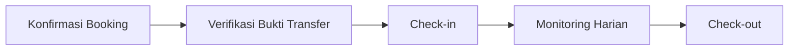

# Flow Admin Penitipan Kucing

Dokumentasi langkah demi langkah alur operasional **admin/staff** untuk modul penitipan (pet hotel).

> **Indeks lengkap semua flow aplikasi** (pelanggan, staff, owner): [`DAFTAR-FLOW-APLIKASI.md`](./DAFTAR-FLOW-APLIKASI.md)

## Urutan Alur Bisnis

| # | Flow | File | Trigger utama |
|---|------|------|---------------|
| 1 | Konfirmasi / tolak booking baru | [`flow-konfirmasi-penitipan-admin.md`](./flow-konfirmasi-penitipan-admin.md) | Pelanggan ajukan penitipan |
| 2 | Verifikasi bukti transfer | [`flow-verifikasi-bukti-penitipan-admin.md`](./flow-verifikasi-bukti-penitipan-admin.md) | Pelanggan upload bukti bayar |
| 3 | Monitoring harian (input + riwayat) | [`flow-monitoring-penitipan-admin.md`](./flow-monitoring-penitipan-admin.md) | Kucing sedang dititipkan |
| 3b | Melihat riwayat monitoring saja | [`flow-melihat-laporan-kucing-admin.md`](./flow-melihat-laporan-kucing-admin.md) | Subset: tab Riwayat |

## Entry Point Bersama (Dashboard Admin)

Semua flow dimulai dari `/admin/dashboard` dengan **Action Center**:

| Widget | Mengarah ke |
|--------|-------------|
| Konfirmasi Penitipan Baru | `/admin/penitipan/booking?status=MENUNGGU_KONFIRMASI` |
| Bukti Transfer Menunggu Verifikasi | `/admin/penitipan/pembayaran` (+ deep-link `#bukti-{id}`) |
| Monitoring Harian Belum Diinput | `/admin/penitipan/booking?status=SEDANG_DITITIPKAN&monitoring=belum_input` |

KPI **Penitipan Aktif** di dashboard → `/admin/penitipan/booking?status=SEDANG_DITITIPKAN`.

## KPI Halaman Booking

Di `/admin/penitipan/booking` terdapat 5 kartu KPI:

| KPI | Clickable | Tujuan |
|-----|-----------|--------|
| Menunggu Konfirmasi | ✅ | Filter booking pending |
| Menunggu Verifikasi Bukti | ✅ | Tab verifikasi bukti |
| Siap / Check-in | — | Indikator saja |
| Sedang Dititipkan | ✅ | Filter booking aktif |
| Belum Input Monitoring | ✅ | Filter aktif yang belum input hari ini |

## Pinned Section Halaman Booking

Saat tidak ada filter aktif, daftar booking menampilkan section prioritas:

| Section | Kondisi |
|---------|---------|
| Perlu Konfirmasi (N) | Status `MENUNGGU_KONFIRMASI` |
| Perlu Monitoring Hari Ini (N) | Status `SEDANG_DITITIPKAN` tanpa monitoring hari ini |

## Notifikasi Staff Terkait

| Jenis | Saat |
|-------|------|
| `BOOKING_PENITIPAN_MENUNGGU_KONFIRMASI` | Pelanggan ajukan booking |
| `BUKTI_PENITIPAN_MENUNGGU_VERIFIKASI` | Pelanggan upload bukti transfer |
| `MONITORING_PENITIPAN` | Staff input monitoring harian (ke pelanggan) |
