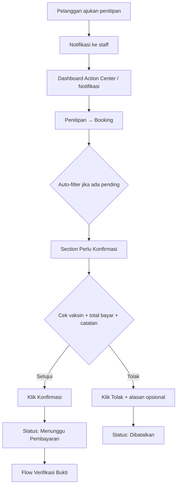
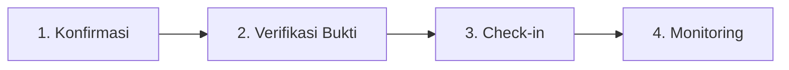

# Flow Konfirmasi Penitipan Kucing (Admin / Staff)

Dokumen ini menjelaskan langkah demi langkah bagaimana **admin/staff petshop** **mengkonfirmasi atau menolak** permintaan penitipan kucing (pet hotel) yang diajukan pelanggan.

---

## Ringkasan Alur (Setelah Perbaikan UX)

---

## Alur Penitipan Admin (Konteks)

Flow ini adalah **langkah 1** dari siklus operasional penitipan:

> Indeks lengkap: [`README.md`](./README.md)

---

## Konteks: Apa yang Terjadi Sebelum Admin Bertindak

Pelanggan mengajukan penitipan melalui aplikasi:

| Langkah pelanggan | Detail |
|-------------------|--------|
| Menu | **Layanan → Penitipan → Ajukan Penitipan** |
| URL form | `/penitipan/booking` |
| Submit | **POST** `/penitipan/booking` |
| Hasil | Status **`MENUNGGU_KONFIRMASI`** |

**Setelah perbaikan UX**, staff langsung mendapat:
- Notifikasi `BOOKING_PENITIPAN_MENUNGGU_KONFIRMASI` di `/admin/notifikasi`
- Widget **Konfirmasi Penitipan Baru** di dashboard admin (preview: pelanggan · kucing · check-in · total)

---

## Prasyarat (Sisi Admin)

| Kondisi | Keterangan |
|---------|------------|
| Role | Staff atau Owner (sudah login) |
| Status booking | **`MENUNGGU_KONFIRMASI`** |
| Syarat vaksin | Minimal **1 riwayat vaksin lengkap** |

---

## Langkah demi Langkah (Yang Diklik Admin)

### 1. Login Admin

| Aksi | Detail |
|------|--------|
| Buka URL | `/admin/login` |
| Klik | **Login** |

---

### 2. Masuk ke Antrian Konfirmasi

**Opsi A — dari Dashboard (disarankan):**

| Urutan | Klik | Hasil |
|--------|------|-------|
| 1 | **Review Booking** di Action Center | `/admin/penitipan/booking?status=MENUNGGU_KONFIRMASI` |
| — | Atau klik item preview di widget | Filter konfirmasi pending |

**Opsi B — dari Notifikasi:**

| Urutan | Klik | Hasil |
|--------|------|-------|
| 1 | **Notifikasi** (navbar) | `/admin/notifikasi` |
| 2 | **Lihat detail** pada notif booking baru | `/admin/penitipan/booking?status=MENUNGGU_KONFIRMASI` |

**Opsi C — dari halaman Booking:**

| Urutan | Klik | Hasil |
|--------|------|-------|
| 1 | **Layanan → Penitipan** | `/admin/penitipan/booking` |
| 2 | KPI **Menunggu Konfirmasi** (grid 5 KPI) | Auto-filter pending |

> Jika ada booking pending dan tidak ada filter aktif, halaman **otomatis** menampilkan filter `MENUNGGU_KONFIRMASI`.

**Grid KPI di halaman Booking** (5 kartu):

| KPI | Clickable | Fungsi |
|-----|-----------|--------|
| Menunggu Konfirmasi | ✅ | Filter antrian konfirmasi |
| Menunggu Verifikasi Bukti | ✅ | Ke tab verifikasi bukti |
| Siap / Check-in | — | Indikator booking lunas siap check-in |
| Sedang Dititipkan | ✅ | Filter booking aktif |
| Belum Input Monitoring | ✅ | Filter aktif tanpa monitoring hari ini |

---

### 3. Review Booking di Antrian

Booking pending ditampilkan di section **Perlu Konfirmasi (N)** (pinned di atas saat melihat semua status).

Informasi yang ditampilkan di kartu:

| Bagian | Keterangan |
|--------|------------|
| Header | Pelanggan · kucing · paket · kamar |
| Periode | Check-in — check-out |
| Total bayar | Termasuk promo & antar-jemput |
| Catatan makan | Langsung terlihat (jika ada) |
| Riwayat vaksin | Accordion **terbuka otomatis** |
| Aksi | Box highlight kuning: Konfirmasi / Tolak |

---

### 4a. Konfirmasi Booking

| Aksi | Detail |
|------|--------|
| Klik | **Konfirmasi** |
| Request | **POST** `/admin/penitipan/booking/konfirmasi` |
| Redirect | Kembali dengan **filter yang sama** |

**Hasil:** Status → `MENUNGGU_PEMBAYARAN` + notifikasi ke pelanggan.

**Langkah berikutnya:** Pelanggan bayar → staff verifikasi bukti → [`flow-verifikasi-bukti-penitipan-admin.md`](./flow-verifikasi-bukti-penitipan-admin.md)

---

### 4b. Tolak Booking

| Aksi | Detail |
|------|--------|
| Isi | **Alasan penolakan** (opsional) |
| Klik | **Tolak** |
| Request | **POST** `/admin/penitipan/booking/tolak` |

**Hasil:** Status → `DIBATALKAN`. Alasan (jika diisi) ikut dikirim ke pelanggan via notifikasi.

---

## Perbandingan Sebelum vs Sesudah

| Aspek | Sebelum | Sesudah |
|-------|---------|---------|
| Notifikasi staff | Tidak ada | Notif + dashboard widget |
| Temukan pending | Filter manual | Auto-filter + KPI clickable |
| Review info | Subtotal saja, vaksin collapsed | Total bayar, catatan makan, vaksin open |
| Tolak | Tanpa alasan | Alasan opsional ke pelanggan |
| Setelah aksi | Redirect tanpa filter | Filter dipertahankan |
| Antrian | Campur semua status | Section **Perlu Konfirmasi** pinned |
| Dashboard preview | Tidak ada | Preview pelanggan · kucing · total |
| KPI Booking | 3 kartu | **5 kartu** (+ Verifikasi Bukti, Belum Input Monitoring) |

---

## Rute & File Terkait

| Komponen | Path |
|----------|------|
| Dashboard admin | `/admin/dashboard` |
| Booking + antrian | `/admin/penitipan/booking` |
| Konfirmasi | `POST /admin/penitipan/booking/konfirmasi` |
| Tolak | `POST /admin/penitipan/booking/tolak` |
| View booking | `src/Views/admin/penitipan/booking/index.php` |
| Kartu booking | `src/Views/admin/penitipan/booking/_card.php` |
| Service | `src/Services/PenitipanBookingService.php` |
| Dashboard service | `src/Services/StaffDashboardService.php` |
| Notifikasi enum | `BOOKING_PENITIPAN_MENUNGGU_KONFIRMASI` |

---

## Catatan Penting

- Konfirmasi **bukan** check-in — pelanggan masih harus bayar dan staff verifikasi bukti transfer.
- Setelah konfirmasi, lanjut ke flow verifikasi: [`flow-verifikasi-bukti-penitipan-admin.md`](./flow-verifikasi-bukti-penitipan-admin.md)
- Untuk melihat semua status, pilih **Semua status** di filter lalu **Terapkan Filter**.
- Indeks alur penitipan admin: [`README.md`](./README.md)
- Flow monitoring setelah check-in: [`flow-monitoring-penitipan-admin.md`](./flow-monitoring-penitipan-admin.md)
