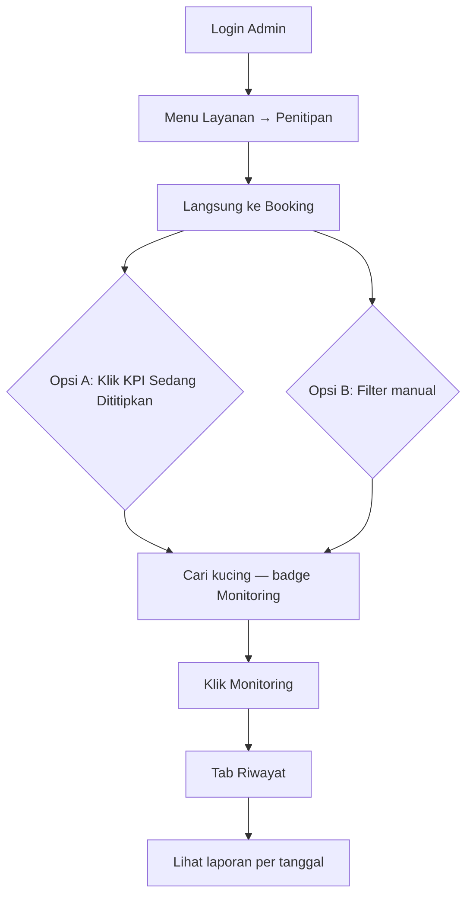
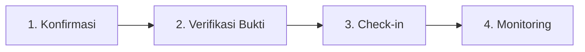

# Flow Melihat Laporan Kucing (Admin / Staff)

> **Catatan:** Dokumen ini fokus pada **melihat riwayat** monitoring. Untuk alur lengkap (check-in, input harian, check-out), lihat [`flow-monitoring-penitipan-admin.md`](./flow-monitoring-penitipan-admin.md).

Dokumen ini menjelaskan langkah demi langkah bagaimana **admin/staff petshop** membuka dan melihat **laporan monitoring harian kucing** selama penitipan (pet hotel).

> **Catatan terminologi:** Di aplikasi, "laporan kucing" = **Monitoring Harian Penitipan** — catatan harian berisi foto, catatan makan, kondisi, dan aktivitas kucing yang sedang dititipkan.

---

## Ringkasan Alur (Setelah Perbaikan UX)

---

## Alur Penitipan Admin (Konteks)

Flow ini adalah bagian dari **langkah 4 — Monitoring**. Lihat alur lengkap di [`flow-monitoring-penitipan-admin.md`](./flow-monitoring-penitipan-admin.md).

| Flow terkait | File |
|--------------|------|
| Monitoring lengkap (input + riwayat) | [`flow-monitoring-penitipan-admin.md`](./flow-monitoring-penitipan-admin.md) |
| Indeks lengkap | [`README.md`](./README.md) |

---

## Prasyarat

| Kondisi | Keterangan |
|---------|------------|
| Role | Staff atau Owner (sudah login di dashboard admin) |
| Status booking aktif | **`SEDANG_DITITIPKAN`** — bisa input & lihat riwayat |
| Status booking selesai | **`CHECK_OUT`** — hanya lihat riwayat (read-only) |
| Data | Staff sudah pernah input monitoring (jika ingin melihat riwayat) |

---

## Langkah demi Langkah (Yang Diklik)

### 1. Login Admin

| Aksi | Detail |
|------|--------|
| Buka URL | `/admin/login` |
| Isi form | Username & password staff |
| Klik | **Login** |
| Redirect | `/admin/dashboard` |

---

### 2. Masuk ke Modul Penitipan

**Desktop (navbar atas):**

| Urutan | Klik | Hasil |
|--------|------|-------|
| 1 | Dropdown **Layanan** | Menu layanan terbuka |
| 2 | **Penitipan** | Langsung ke **`/admin/penitipan/booking`** |

**Mobile (hamburger menu):**

| Urutan | Klik | Hasil |
|--------|------|-------|
| 1 | Icon **menu** (☰) | Panel navigasi mobile terbuka |
| 2 | **Penitipan** (bagian Layanan) | Langsung ke **`/admin/penitipan/booking`** |

> **Perbaikan UX:** Sebelumnya landing di tab Paket (+1 klik). Sekarang langsung ke Booking.

---

### 3. Filter Booking Aktif (Shortcut)

Di halaman **Booking Penitipan**, grid **4 KPI** tersedia:

| KPI | Clickable | Fungsi |
|-----|-----------|--------|
| Menunggu Konfirmasi | ✅ | Filter pending konfirmasi |
| Menunggu Verifikasi Bukti | ✅ | Ke halaman verifikasi |
| Siap / Check-in | — | Indikator booking lunas |
| **Sedang Dititipkan** | ✅ | **Filter booking aktif (disarankan)** |

**Opsi A — Klik KPI card (disarankan):**

| Aksi | Detail |
|------|--------|
| Klik | Kartu KPI **Sedang Dititipkan** |
| Hasil | Auto-filter `?status=SEDANG_DITITIPKAN` |

**Opsi B — Filter manual:**

| Elemen | Fungsi |
|--------|--------|
| Filter status | Pilih **Sedang Dititipkan** atau **Check-out** |
| Filter check-in | Opsional |
| Klik | **Terapkan Filter** |

---

### 4. Buka Monitoring dari Kartu Booking

Pada kartu booking, tombol **`Monitoring`** tersedia jika status:

| Status | Tombol | Badge |
|--------|--------|-------|
| Sedang Dititipkan | ✅ Monitoring | `Hari ini` (hijau) atau `Belum input` (kuning) |
| Check-out | ✅ Monitoring | `{N} laporan` (read-only) |

| Aksi | Detail |
|------|--------|
| Klik | **`Monitoring`** |
| URL aktif (lihat riwayat) | `...&tab=riwayat` |
| URL check-out | `...&tab=riwayat` (langsung ke riwayat) |

> **Perbaikan UX:** Label diganti dari "Input Monitoring" → **"Monitoring"** + badge status di kartu.

---

### 5. Tab Riwayat

| Aksi | Detail |
|------|--------|
| Klik tab | **Riwayat (N)** |
| URL | `/admin/penitipan/monitoring/tambah?booking_id={id}&tab=riwayat` |

**Booking check-out:** Hanya tampil riwayat (mode baca saja, tanpa form input).

Setiap entri riwayat menampilkan:

| Field | Contoh |
|-------|--------|
| Tanggal | `06/09/2026` |
| Staff | Nama staff yang input |
| Foto | Gambar kucing (lightbox) |
| Makan | Catatan makan |
| Kondisi | Kondisi kesehatan / mood |
| Aktivitas | Aktivitas harian |

> Untuk **input monitoring baru**, gunakan tab **Input Baru** — lihat [`flow-monitoring-penitipan-admin.md`](./flow-monitoring-penitipan-admin.md).

---

### 6. Kembali ke Daftar Booking

| Aksi | Detail |
|------|--------|
| Klik breadcrumb **Booking** | Kembali ke `/admin/penitipan/booking` |
| Atau klik **Kembali ke Booking** | Di bawah riwayat |

---

## Perbandingan Sebelum vs Sesudah

| Aspek | Sebelum | Sesudah |
|-------|---------|---------|
| Entry Penitipan | Landing Paket (+1 klik) | Langsung Booking |
| Filter aktif | Manual saja | KPI card bisa diklik |
| Label tombol | "Input Monitoring" | "Monitoring" + badge |
| Lihat riwayat | Scroll di bawah form | Tab **Riwayat** terpisah |
| Post check-out | Tombol hilang | Tetap bisa lihat riwayat |
| KPI Booking | 3 kartu | **5 kartu** (termasuk Verifikasi Bukti, Belum Input Monitoring) |

---

## Rute & File Terkait

| Komponen | Path |
|----------|------|
| Entry penitipan | `GET /admin/penitipan` → redirect booking |
| Daftar booking | `GET /admin/penitipan/booking` |
| Filter cepat | `GET /admin/penitipan/booking?status=SEDANG_DITITIPKAN` |
| Halaman monitoring | `GET /admin/penitipan/monitoring/tambah?booking_id={id}&tab=riwayat` |
| Controller | `src/Controllers/Admin/PenitipanController.php` |
| View booking | `src/Views/admin/penitipan/booking/index.php` |
| View monitoring | `src/Views/admin/penitipan/monitoring/form.php` |
| Repository | `src/Repositories/MonitoringPenitipanRepository.php` |
| Flow lengkap | [`flow-monitoring-penitipan-admin.md`](./flow-monitoring-penitipan-admin.md) |

---

## Catatan Penting

- **Laporan** di menu admin (`/admin/laporan/penitipan`) = statistik bisnis, bukan laporan harian per kucing.
- Laporan harian per kucing ada di halaman **Monitoring** → tab **Riwayat**.
- Tab **Paket / Kamar / Kuota** tetap bisa diakses lewat sub-nav di dalam modul penitipan.
- Prasyarat: booking sudah **check-in** → **Sedang Dititipkan**, atau sudah **check-out** (riwayat read-only).
- Indeks alur penitipan admin: [`README.md`](./README.md)
