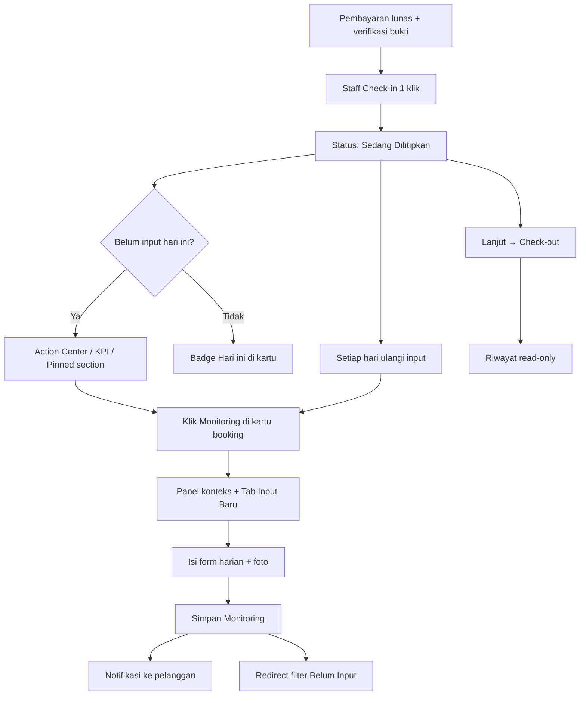
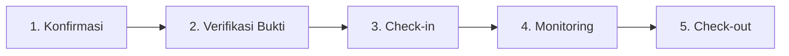
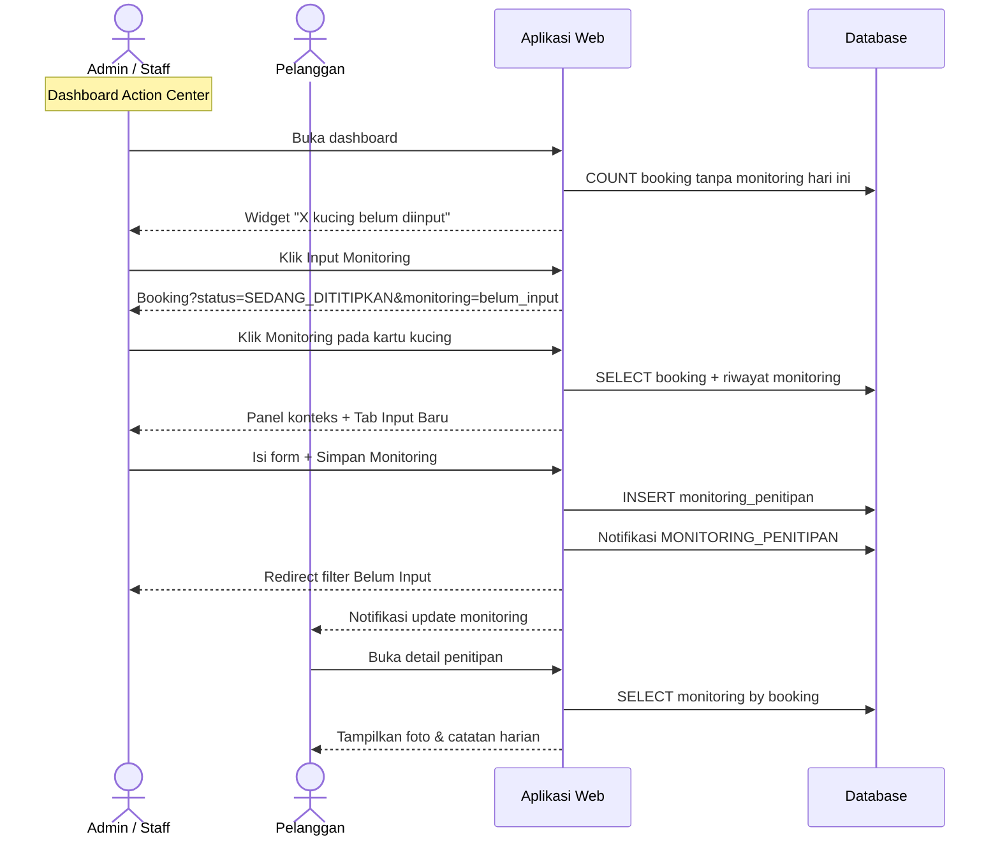
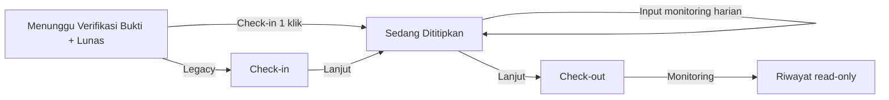

# Flow Monitoring Harian Penitipan (Admin / Staff)

Dokumen ini menjelaskan langkah demi langkah bagaimana **admin/staff petshop** **menginput dan melihat monitoring harian kucing** selama penitipan (pet hotel) — termasuk prasyarat check-in, Action Center, dan alur status operasional.

> **Catatan terminologi:** Di aplikasi, fitur ini bernama **Monitoring Harian Penitipan** — catatan per hari berisi foto, catatan makan, kondisi, dan aktivitas kucing.

---

## Ringkasan Alur (Setelah Perbaikan UX)

---

## Alur Penitipan Admin (Konteks)

Flow ini adalah **langkah 4** dalam siklus operasional — setelah konfirmasi, verifikasi bukti, dan check-in:

| Flow sebelumnya | File |
|-----------------|------|
| Konfirmasi booking | [`flow-konfirmasi-penitipan-admin.md`](./flow-konfirmasi-penitipan-admin.md) |
| Verifikasi bukti | [`flow-verifikasi-bukti-penitipan-admin.md`](./flow-verifikasi-bukti-penitipan-admin.md) |
| Indeks lengkap | [`README.md`](./README.md) |

---

## Konteks: Apa yang Terjadi Sebelum Monitoring

Alur sebelum staff bisa input monitoring:

| Langkah | Detail |
|---------|--------|
| 1. Booking dikonfirmasi | Status → `MENUNGGU_PEMBAYARAN` |
| 2. Pelanggan bayar + upload bukti | Status → `MENUNGGU_VERIFIKASI_BUKTI` |
| 3. Staff verifikasi bukti | Transaksi → `LUNAS` |
| 4. Staff **Check-in** saat kucing tiba | Status langsung → **`SEDANG_DITITIPKAN`** (1 klik) |

> Monitoring **hanya bisa diinput** saat status **`SEDANG_DITITIPKAN`**.  
> Status `CHECK_IN` masih didukung untuk booking legacy — tombol **Lanjut → Sedang Dititipkan** tetap tersedia.  
> Flow verifikasi bukti: [`flow-verifikasi-bukti-penitipan-admin.md`](./flow-verifikasi-bukti-penitipan-admin.md)

---

## Prasyarat (Sisi Admin)

| Kondisi | Keterangan |
|---------|------------|
| Role | Staff atau Owner (sudah login) |
| Input monitoring | Status booking = **`SEDANG_DITITIPKAN`** |
| Lihat riwayat | Status **`SEDANG_DITITIPKAN`** atau **`CHECK_OUT`** |
| Pembayaran | Transaksi sudah **`LUNAS`** (sebelum check-in) |

---

## Langkah demi Langkah (Yang Diklik Admin)

### 1. Login Admin

| Aksi | Detail |
|------|--------|
| Buka URL | `/admin/login` |
| Klik | **Login** |
| Redirect | `/admin/dashboard` |

---

### 2. Check-in (1 Klik)

| Aksi | Detail |
|------|--------|
| Buka | `/admin/penitipan/booking` |
| Cari booking | Status *"Pembayaran Lunas — Menunggu Check-in"* |
| Klik | **Check-in** |
| Request | **POST** `/admin/penitipan/booking/check-in` |
| Hasil | Status langsung → **`SEDANG_DITITIPKAN`** |
| Flash | *"Check-in berhasil. Kucing sedang dititipkan."* |

> Tombol **Monitoring** dan form input langsung tersedia setelah check-in.

---

### 3. Action Center — Monitoring Belum Diinput

Di **Dashboard Admin** (`/admin/dashboard`), widget Action Center menampilkan:

| Elemen | Detail |
|--------|--------|
| Judul | **Monitoring Harian Belum Diinput** |
| Pesan | *"X kucing belum diinput monitoring hari ini."* |
| Preview | Daftar kucing (pemilik · nama kucing · check-out) |
| CTA | **Input Monitoring** → `?status=SEDANG_DITITIPKAN&monitoring=belum_input` |

KPI **Penitipan Aktif** di dashboard mengarah ke `?status=SEDANG_DITITIPKAN`.

---

### 4. Masuk ke Daftar Kucing Aktif

**Opsi A — Action Center / KPI (disarankan):**

| Urutan | Klik | Hasil |
|--------|------|-------|
| 1 | **Layanan → Penitipan** | `/admin/penitipan/booking` |
| 2 | KPI **Belum Input Monitoring** | `?status=SEDANG_DITITIPKAN&monitoring=belum_input` |
| 3 | KPI **Sedang Dititipkan** | `?status=SEDANG_DITITIPKAN` |

**Opsi B — Pinned section (tanpa filter):**

| Elemen | Detail |
|--------|--------|
| Section | **Perlu Monitoring Hari Ini (N)** |
| Posisi | Di atas daftar booking lainnya |
| Isi | Kartu booking aktif yang belum input monitoring hari ini |

**Grid KPI di halaman Booking** (5 kartu):

| KPI | Clickable | Fungsi |
|-----|-----------|--------|
| Menunggu Konfirmasi | ✅ | Filter konfirmasi |
| Menunggu Verifikasi Bukti | ✅ | Ke verifikasi bukti |
| Siap / Check-in | — | Indikator |
| Sedang Dititipkan | ✅ | Filter kucing aktif |
| **Belum Input Monitoring** | ✅ | **Filter yang belum input hari ini** |

---

### 5. Identifikasi Prioritas di Kartu Booking

Pada setiap kartu booking aktif, tombol **Monitoring** menampilkan badge:

| Badge | Arti |
|-------|------|
| **Hari ini** (hijau) | Monitoring hari ini sudah diinput |
| **Belum input** (kuning) | Belum ada monitoring untuk hari ini |
| **{N} laporan** | Total riwayat (setelah check-out) |

| Aksi | Detail |
|------|--------|
| Klik | **Monitoring** |
| URL aktif | `/admin/penitipan/monitoring/tambah?booking_id={id}` |
| URL check-out | `...&tab=riwayat` (read-only) |

---

### 6. Input Monitoring Harian

Di halaman monitoring:

**Panel konteks** (di atas form):

| Field | Sumber |
|-------|--------|
| Check-in / Check-out | Booking |
| Sisa hari | Dihitung dari check-out |
| Catatan makan (booking) | Dari form pelanggan saat booking |
| Monitoring terakhir | Entri monitoring terbaru |

Tab **Input Baru** (default saat booking aktif):

| Field | Wajib | Keterangan |
|-------|-------|------------|
| Tanggal | ✅ | Default hari ini; **tidak boleh duplikat** per booking |
| Foto | — | Upload gambar kucing (opsional) |
| Catatan makan | ⚠️ | Minimal **1 field teks** wajib diisi |
| Kondisi | ⚠️ | (makan, kondisi, atau aktivitas) |
| Aktivitas harian | ⚠️ | — |

| Aksi | Detail |
|------|--------|
| Isi form | Sesuai observasi harian |
| Klik | **Simpan Monitoring** |
| Request | **POST** `/admin/penitipan/monitoring/tambah` |
| Redirect | `/admin/penitipan/booking?status=SEDANG_DITITIPKAN&monitoring=belum_input` |
| Flash | *"Monitoring harian tersimpan."* |

**Yang terjadi di sistem:**

| Perubahan | Detail |
|-----------|--------|
| Database | INSERT `monitoring_penitipan` |
| Pelanggan | Notifikasi `MONITORING_PENITIPAN` |
| Pesan notif | *"Staff petshop telah menginput monitoring harian untuk tanggal …"* |
| Kartu booking | Badge berubah → **Hari ini** |

**Validasi:**

| Aturan | Pesan error |
|--------|-------------|
| Tanggal sudah ada | *"Monitoring untuk tanggal ini sudah diinput. Lihat tab Riwayat."* |
| Semua field teks kosong | *"Isi minimal satu catatan: makan, kondisi, atau aktivitas harian."* |

---

### 7. Lihat Riwayat Monitoring

**Saat booking aktif:**

| Aksi | Detail |
|------|--------|
| Klik tab | **Riwayat (N)** |
| URL | `...&tab=riwayat` |

**Saat booking check-out:**

| Kondisi | Perilaku |
|---------|----------|
| Status `CHECK_OUT` | Hanya riwayat — **mode baca saja**, tanpa form input |
| Pesan | *"Mode baca saja — booking sudah check-out."* |

Setiap entri riwayat menampilkan:

| Field | Contoh |
|-------|--------|
| Tanggal | `06/09/2026` |
| Staff | Nama staff yang input |
| Foto | Gambar kucing (klik → lightbox) |
| Makan | Catatan makan |
| Kondisi | Kondisi kesehatan / mood |
| Aktivitas | Aktivitas harian |

---

### 8. Check-out (Akhir Penitipan)

Setelah masa penitipan selesai:

| Aksi | Detail |
|------|--------|
| Klik | **Lanjut → Check-out** di kartu booking |
| Request | **POST** `/admin/penitipan/booking/status` |
| Hasil | Status → **`CHECK_OUT`** |

Riwayat monitoring tetap bisa dibuka (read-only) lewat tombol **Monitoring** → `{N} laporan`.

---

## Diagram Sequence

---

## Alur Status Terkait

---

## Perbandingan Sebelum vs Sesudah (UX)

| Aspek | Sebelum | Sesudah |
|-------|---------|---------|
| Check-in | 2 langkah (Check-in → Lanjut) | **1 klik** langsung `SEDANG_DITITIPKAN` |
| Action Center | Hanya konfirmasi + verifikasi | + **Monitoring belum diinput** |
| Pinned section | Hanya konfirmasi | + **Perlu Monitoring Hari Ini** |
| KPI Booking | 4 kartu | **5 kartu** (+ Belum Input Monitoring) |
| Filter monitoring | Tidak ada | `?monitoring=belum_input` |
| Form monitoring | Tanpa konteks | **Panel konteks** (makan, sisa hari, terakhir) |
| Validasi | Lemah | Duplikat tanggal + min 1 field teks |
| Post-save redirect | Tab Riwayat | **Filter Belum Input** (lanjut kucing berikutnya) |
| Dashboard Penitipan Aktif | Ke booking umum | Ke `?status=SEDANG_DITITIPKAN` |

---

## Rute & File Terkait

| Komponen | Path |
|----------|------|
| Entry penitipan | `GET /admin/penitipan` → redirect booking |
| Daftar booking | `GET /admin/penitipan/booking` |
| Filter aktif | `GET /admin/penitipan/booking?status=SEDANG_DITITIPKAN` |
| Filter belum input | `GET /admin/penitipan/booking?status=SEDANG_DITITIPKAN&monitoring=belum_input` |
| Check-in | `POST /admin/penitipan/booking/check-in` |
| Update status operasional | `POST /admin/penitipan/booking/status` |
| Halaman monitoring | `GET /admin/penitipan/monitoring/tambah?booking_id={id}&tab=input\|riwayat` |
| Simpan monitoring | `POST /admin/penitipan/monitoring/tambah` |
| Controller | `src/Controllers/Admin/PenitipanController.php` |
| Service | `src/Services/MonitoringPenitipanService.php` |
| Dashboard service | `src/Services/StaffDashboardService.php` |
| View booking + kartu | `src/Views/admin/penitipan/booking/index.php`, `_card.php` |
| View monitoring | `src/Views/admin/penitipan/monitoring/form.php` |
| View dashboard | `src/Views/dashboard/admin.php` |
| Repository | `src/Repositories/MonitoringPenitipanRepository.php` |
| Notifikasi enum | `MONITORING_PENITIPAN` |
| Sequence diagram | `diagrams/sequence/sequence-monitoring-penitipan.puml` |
| Indeks alur | [`README.md`](./README.md) |

---

## Catatan Penting

- **Monitoring ≠ Laporan bisnis** — menu `/admin/laporan/penitipan` adalah statistik, bukan catatan harian per kucing.
- Input monitoring **ditolak** jika status bukan `SEDANG_DITITIPKAN` (termasuk saat masih `CHECK_IN` legacy).
- Staff disarankan input **setiap hari** selama masa penitipan — badge **Belum input**, Action Center, dan pinned section membantu identifikasi.
- Pelanggan melihat riwayat monitoring di halaman detail penitipan (`/penitipan/detail?id={id}`).
- Flow terkait:
  - Verifikasi bukti (sebelum check-in) → [`flow-verifikasi-bukti-penitipan-admin.md`](./flow-verifikasi-bukti-penitipan-admin.md)
  - Melihat riwayat saja (subset) → [`flow-melihat-laporan-kucing-admin.md`](./flow-melihat-laporan-kucing-admin.md)
