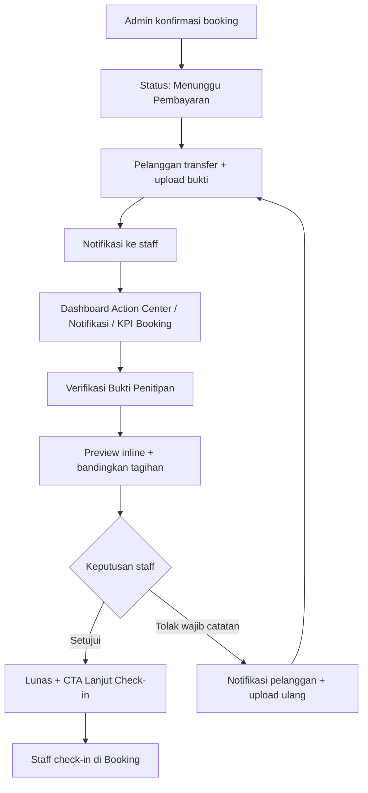
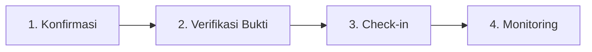
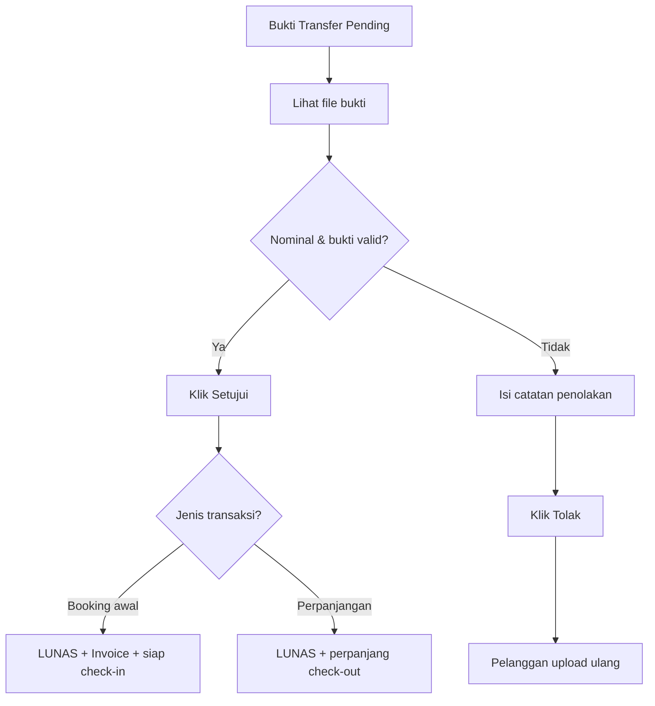
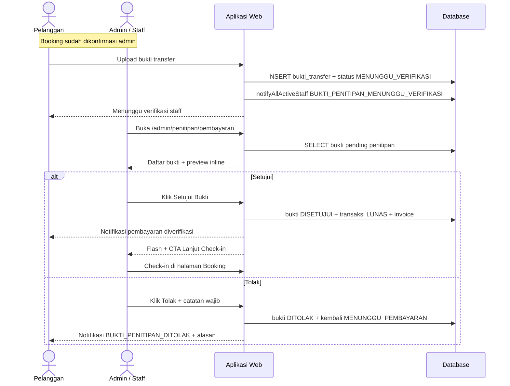
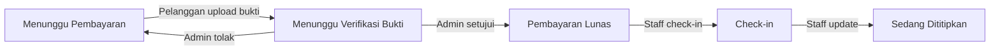

# Flow Verifikasi Bukti Transfer Penitipan (Admin / Staff)

Dokumen ini menjelaskan langkah demi langkah bagaimana **admin/staff petshop** **memverifikasi bukti transfer** pembayaran penitipan kucing (pet hotel) — termasuk pembayaran booking awal dan perpanjangan.

---

## Ringkasan Alur (Setelah Perbaikan UX)

---

## Alur Penitipan Admin (Konteks)

Flow ini adalah **langkah 2** — setelah konfirmasi booking, sebelum check-in:

> Indeks lengkap: [`README.md`](./README.md)

---

## Konteks: Apa yang Terjadi Sebelum Admin Bertindak

Alur pelanggan sebelum bukti masuk antrian verifikasi:

| Langkah | Detail |
|---------|--------|
| 1. Booking dikonfirmasi admin | Status → **`MENUNGGU_PEMBAYARAN`** |
| 2. Pelanggan buka detail penitipan | `/penitipan/detail?id={id}` |
| 3. Klik **Upload Bukti Transfer** | `/penitipan/pembayaran?id={id}` |
| 4. Transfer ke rekening petshop | Lihat info bank di halaman pembayaran |
| 5. Upload file bukti | **POST** `/penitipan/pembayaran` |
| 6. Hasil | Status → **`MENUNGGU_VERIFIKASI_BUKTI`** |

Pelanggan melihat pesan: *"Bukti transfer berhasil diupload. Menunggu verifikasi staff."*

**Setelah perbaikan UX**, staff langsung mendapat:
- Notifikasi `BUKTI_PENITIPAN_MENUNGGU_VERIFIKASI` di `/admin/notifikasi`
- Widget **Bukti Transfer Menunggu Verifikasi** di dashboard admin (preview + deep-link ke item)

> Flow konfirmasi booking admin: [`flow-konfirmasi-penitipan-admin.md`](./flow-konfirmasi-penitipan-admin.md)

---

## Prasyarat (Sisi Admin)

| Kondisi | Keterangan |
|---------|------------|
| Role | Staff atau Owner (sudah login) |
| Status transaksi | **`MENUNGGU_VERIFIKASI`** |
| Status bukti | **`MENUNGGU`** (belum disetujui/ditolak) |
| Jenis layanan | **`PENITIPAN`** (booking awal atau perpanjangan) |

---

## Langkah demi Langkah (Yang Diklik Admin)

### 1. Login Admin

| Aksi | Detail |
|------|--------|
| Buka URL | `/admin/login` |
| Klik | **Login** |
| Redirect | `/admin/dashboard` |

---

### 2. Masuk ke Halaman Verifikasi Bukti

**Opsi A — dari Dashboard Action Center (disarankan):**

| Urutan | Klik | Hasil |
|--------|------|-------|
| 1 | Section **Bukti Transfer Menunggu Verifikasi** | — |
| 2 | Item preview **atau** **Verifikasi Penitipan** | `/admin/penitipan/pembayaran#bukti-{id}` |

**Opsi B — dari Notifikasi:**

| Urutan | Klik | Hasil |
|--------|------|-------|
| 1 | **Notifikasi** (navbar) | `/admin/notifikasi` |
| 2 | **Lihat detail** pada notif bukti baru | `/admin/penitipan/pembayaran` |

**Opsi C — dari menu navigasi:**

| Urutan | Klik | Hasil |
|--------|------|-------|
| 1 | Dropdown **Layanan** | Menu layanan terbuka |
| 2 | **Verifikasi Penitipan** | `/admin/penitipan/pembayaran` |

**Mobile:**

| Urutan | Klik | Hasil |
|--------|------|-------|
| 1 | Icon **menu** (☰) | Panel navigasi terbuka |
| 2 | **Verifikasi Penitipan** (bagian Layanan) | `/admin/penitipan/pembayaran` |

**Opsi D — dari modul Penitipan:**

| Urutan | Klik | Hasil |
|--------|------|-------|
| 1 | **Layanan → Penitipan** | `/admin/penitipan/booking` |
| 2 | KPI **Menunggu Verifikasi Bukti** | `/admin/penitipan/pembayaran` |
| 3 | Sub-nav tab **Verifikasi Bukti** | `/admin/penitipan/pembayaran` |

---

### 3. Temukan Bukti yang Perlu Diverifikasi

Di halaman **Verifikasi Bukti Penitipan**:

| Indikator | Keterangan |
|-----------|------------|
| Section pinned | **Perlu Verifikasi (N)** |
| Badge header | `{N} menunggu` — jumlah bukti pending |
| Badge prioritas | **Check-in hari ini/besok**, **Menunggu X jam** (>24 jam) |
| Kartu bukti | Layout 2 kolom: detail + preview inline |
| Empty state | *"Semua bukti sudah diverifikasi"* jika antrian kosong |

Antrian diurutkan: **check-in urgent** di atas, lalu **FIFO** (upload paling lama menunggu).

---

### 4. Tinjau Detail Bukti

Setiap kartu menampilkan:

| Bagian | Isi |
|--------|-----|
| Header | Pelanggan · **nama kucing** · paket · lama hari |
| Jenis | Badge **Booking** atau **Perpanjangan** |
| Prioritas | Badge check-in urgent / lama menunggu verifikasi |
| Nominal | Total tagihan (Rp) + breakdown subtotal/promo/antar-jemput |
| Konteks | Check-in/out, waktu upload, **batas waktu bayar** |
| Preview | Gambar inline (lightbox) atau link PDF |

Sebelum memutuskan, staff membandingkan:
- Nominal transfer vs total tagihan
- Nama pengirim / rekening (dari foto bukti)
- Tanggal transfer vs batas waktu bayar

---

### 5a. Setujui Bukti Transfer

| Aksi | Detail |
|------|--------|
| Klik | Tombol hijau **Setujui Bukti** |
| Konfirmasi dialog | *"Setujui bukti transfer ini? Pembayaran akan ditandai lunas."* |
| Request | **POST** `/admin/penitipan/pembayaran/setujui` |
| Flash message | *"Bukti disetujui. Pembayaran lunas."* + tombol **Lanjut Check-in** |

**Yang terjadi di sistem (booking awal):**

| Perubahan | Detail |
|-----------|--------|
| Bukti transfer | Status verifikasi → **DISETUJUI** |
| Transaksi | Status pembayaran → **`LUNAS`** |
| Invoice | Dibuat otomatis (jika belum ada) |
| Promo penitipan | Ditandai terpakai (jika booking pakai promo) |
| Booking | Tetap **`MENUNGGU_VERIFIKASI_BUKTI`**, ditampilkan sebagai *"Pembayaran Lunas — Menunggu Check-in"* |
| Notifikasi pelanggan | *"Pembayaran diverifikasi. Anda dapat mengunduh invoice."* |

**Yang terjadi di sistem (perpanjangan):**

| Perubahan | Detail |
|-----------|--------|
| Perpanjangan | Status → **`DISETUJUI`** |
| Booking | Check-out & lama penitipan diperbarui |
| Notifikasi pelanggan | *"Pembayaran perpanjangan sebesar Rp … telah diverifikasi. Masa penitipan diperpanjang."* |

**Langkah berikutnya (staff):**

1. Klik tombol **Lanjut Check-in** di flash sukses, **atau**
2. Buka **Booking Penitipan** → `/admin/penitipan/booking?status=MENUNGGU_VERIFIKASI_BUKTI&check_in={tanggal}`
3. Klik **Check-in** saat kucing tiba

---

### 5b. Tolak Bukti Transfer

| Aksi | Detail |
|------|--------|
| Isi | **Catatan penolakan** (**wajib**, min. 10 karakter) |
| Klik | Tombol merah **Tolak** |
| Konfirmasi dialog | *"Tolak bukti transfer ini? Pelanggan perlu mengunggah ulang."* |
| Request | **POST** `/admin/penitipan/pembayaran/tolak` |
| Flash message | *"Bukti ditolak."* |

**Yang terjadi di sistem:**

| Perubahan | Detail |
|-----------|--------|
| Bukti transfer | Status verifikasi → **DITOLAK** |
| Transaksi | Kembali ke **`MENUNGGU_PEMBAYARAN`** |
| Booking / perpanjangan | Kembali ke **`MENUNGGU_PEMBAYARAN`** |
| Pelanggan | Notifikasi `BUKTI_PENITIPAN_DITOLAK` + alasan → upload ulang |

---

## Perbandingan Sebelum vs Sesudah

| Aspek | Sebelum | Sesudah |
|-------|---------|---------|
| Notifikasi staff | Tidak ada | `BUKTI_PENITIPAN_MENUNGGU_VERIFIKASI` + dashboard widget |
| Preview bukti | Link buka tab baru | **Inline preview** + lightbox (parity grooming) |
| Info kartu | Nama + nominal saja | Kucing, paket, breakdown, batas bayar, upload time |
| Prioritas | FIFO saja | Badge check-in urgent + lama menunggu |
| Setujui | Tanpa konfirmasi | Dialog konfirmasi + flash **Lanjut Check-in** |
| Tolak | Catatan opsional, tanpa notif pelanggan | **Wajib** min. 10 karakter + notif `BUKTI_PENITIPAN_DITOLAK` |
| Discovery | Menu saja | Dashboard preview + notifikasi + **KPI Booking** |
| Antrian | Flat list | Section **Perlu Verifikasi (N)** pinned |

---

## Diagram Keputusan Verifikasi

---

## Diagram Sequence

---

## Alur Status Terkait

---

## Rute & File Terkait

| Komponen | Path |
|----------|------|
| Halaman verifikasi | `GET /admin/penitipan/pembayaran` |
| Setujui bukti | `POST /admin/penitipan/pembayaran/setujui` |
| Tolak bukti | `POST /admin/penitipan/pembayaran/tolak` |
| Upload bukti (pelanggan) | `GET/POST /penitipan/pembayaran` |
| Controller admin | `src/Controllers/Admin/PenitipanController.php` |
| Service verifikasi | `src/Services/PembayaranService.php` |
| View verifikasi | `src/Views/admin/penitipan/pembayaran/index.php` |
| Repository antrian | `TransaksiRepository::findPendingVerificationPenitipan()` |
| Dashboard service | `src/Services/StaffDashboardService.php` |
| Notifikasi enum | `BUKTI_PENITIPAN_MENUNGGU_VERIFIKASI`, `BUKTI_PENITIPAN_DITOLAK` |
| Flash + CTA | `src/Views/partials/flash.php` |
| Sequence diagram | `diagrams/sequence/sequence-diagram.md` § Pembayaran & Verifikasi |
| Indeks alur | [`README.md`](./README.md) |

---

## Catatan Penting

- Halaman ini juga menangani **bukti perpanjangan penitipan** (badge kuning "Perpanjangan").
- Verifikasi bukti **bukan** check-in — setelah disetujui, staff masih perlu klik **Check-in** di halaman Booking.
- Jika pelanggan tidak bayar sebelum **batas waktu bayar**, booking otomatis dibatalkan oleh scheduler sistem.
- Dashboard admin menampilkan preview antrian verifikasi di **Action Center** dengan deep-link ke item spesifik.
- KPI **Menunggu Verifikasi Bukti** di halaman Booking mengarah ke tab verifikasi.
- Indeks alur penitipan admin: [`README.md`](./README.md)
- Flow terkait:
  - Konfirmasi booking → [`flow-konfirmasi-penitipan-admin.md`](./flow-konfirmasi-penitipan-admin.md)
  - Monitoring harian → [`flow-monitoring-penitipan-admin.md`](./flow-monitoring-penitipan-admin.md)
