# Sequence Diagram — Aplikasi Petshop

Diagram urutan interaksi berdasarkan [idea.md](../../idea.md) dan [activity diagram](../activity/activity-diagram.md).

**Aktor:**
- **Pelanggan** — pengguna layanan
- **Staff / Owner** — operasional internal petshop

**Komponen sistem:**
- **Aplikasi Web** — antarmuka pengguna (frontend)
- **Backend API** — logika bisnis & autentikasi
- **Database** — PostgreSQL
- **Scheduler (Sistem)** — job otomatis (batas waktu pembayaran)

> **Preview:** Gunakan ekstensi PlantUML di VS Code/Cursor, atau render di [plantuml.com](https://www.plantuml.com/plantuml/uml).
>
> File `.puml` terpisah: `sequence-autentikasi-pelanggan.puml`, `sequence-autentikasi-staff.puml`, `sequence-data-kucing.puml`, `sequence-booking-grooming.puml`, `sequence-booking-penitipan.puml`, `sequence-booking-petcare.puml`, `sequence-pembayaran.puml`, `sequence-pembatalan-refund.puml`, `sequence-monitoring-penitipan.puml`, `sequence-perpanjangan-penitipan.puml`, `sequence-manajemen-staff-owner.puml`, `sequence-pengaturan-petshop.puml`, `sequence-laporan.puml`

---

## Daftar diagram

| No | Diagram | Aktor utama | File |
|----|---------|-------------|------|
| 1 | Autentikasi Pelanggan | Pelanggan | [sequence-autentikasi-pelanggan.puml](./sequence-autentikasi-pelanggan.puml) |
| 2 | Autentikasi Staff / Owner | Staff, Owner | [sequence-autentikasi-staff.puml](./sequence-autentikasi-staff.puml) |
| 3 | Kelola Data Kucing | Pelanggan | [sequence-data-kucing.puml](./sequence-data-kucing.puml) |
| 4 | Booking Grooming | Pelanggan, Staff | [sequence-booking-grooming.puml](./sequence-booking-grooming.puml) |
| 5 | Booking Penitipan | Pelanggan, Staff | [sequence-booking-penitipan.puml](./sequence-booking-penitipan.puml) |
| 6 | Booking Pet Care | Pelanggan, Staff | [sequence-booking-petcare.puml](./sequence-booking-petcare.puml) |
| 7 | Pembayaran & Verifikasi | Pelanggan, Staff, Sistem | [sequence-pembayaran.puml](./sequence-pembayaran.puml) |
| 8 | Pembatalan & Refund | Pelanggan, Staff | [sequence-pembatalan-refund.puml](./sequence-pembatalan-refund.puml) |
| 9 | Monitoring Penitipan | Staff, Pelanggan | [sequence-monitoring-penitipan.puml](./sequence-monitoring-penitipan.puml) |
| 10 | Perpanjangan Penitipan | Pelanggan, Staff | [sequence-perpanjangan-penitipan.puml](./sequence-perpanjangan-penitipan.puml) |
| 11 | Manajemen Staff (Owner) | Owner | [sequence-manajemen-staff-owner.puml](./sequence-manajemen-staff-owner.puml) |
| 12 | Pengaturan Bisnis Petshop (Owner) | Owner | [sequence-pengaturan-petshop.puml](./sequence-pengaturan-petshop.puml) |
| 13 | Laporan (Dashboard Admin) | Staff, Owner | [sequence-laporan.puml](./sequence-laporan.puml) |

---

## 1. Autentikasi Pelanggan

Alur daftar akun, login, lupa/reset password, ubah password, dan logout.

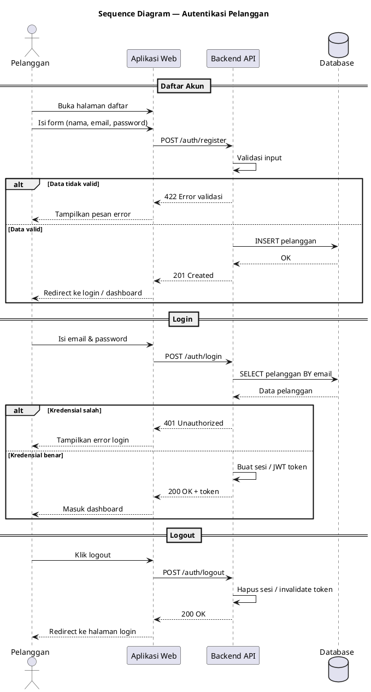

---

## 2. Autentikasi Staff / Owner

Login terpisah dari akun pelanggan; owner dan staff memakai portal internal yang sama.

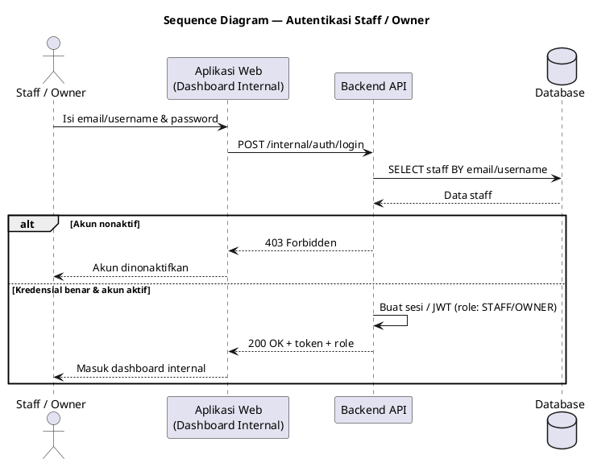

---

## 3. Kelola Data Kucing

Tambah, edit, hapus kucing milik pelanggan; validasi booking aktif saat hapus.

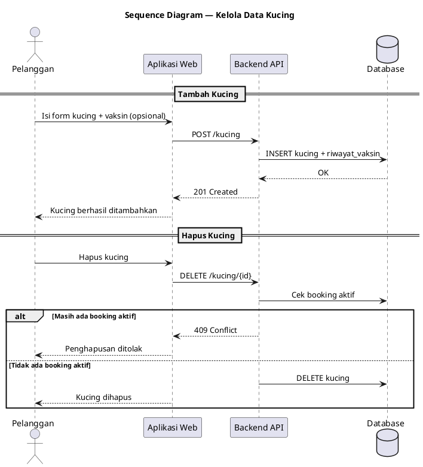

---

## 4. Booking Grooming (End-to-End)

Alur lengkap: ajukan booking → konfirmasi staff & set jam → pembayaran → verifikasi → proses layanan.

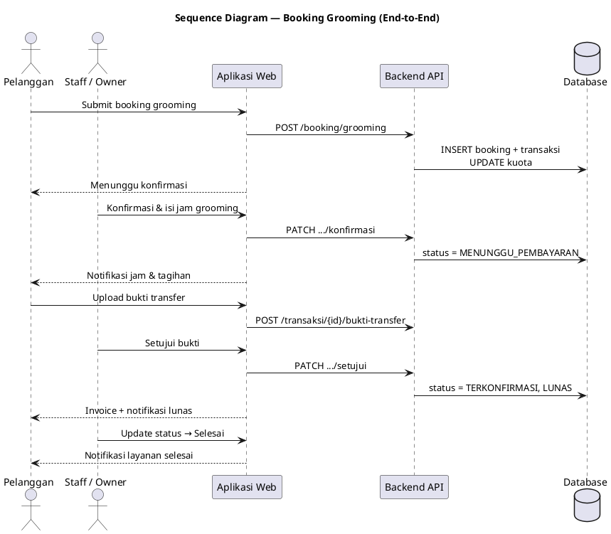

---

## 5. Booking Penitipan / Pet Hotel (End-to-End)

Validasi vaksin, promo 10%, antar-jemput, monitoring harian, check-in/out.

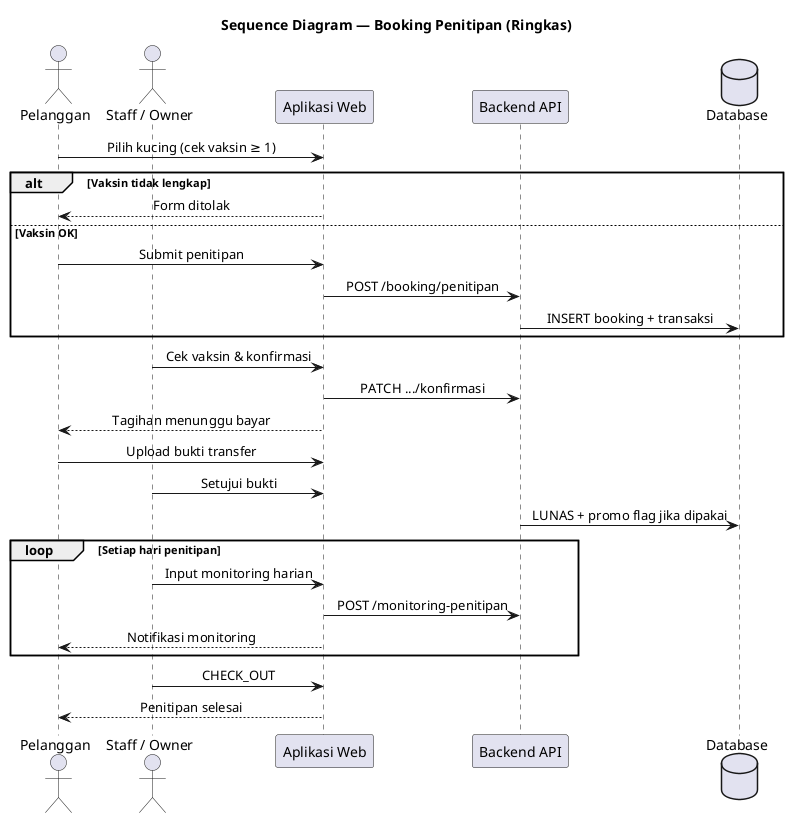

---

## 6. Booking Pet Care (Booking Only)

Booking-only, auto-confirm, pembayaran di loket; jadwal slot dokter global.

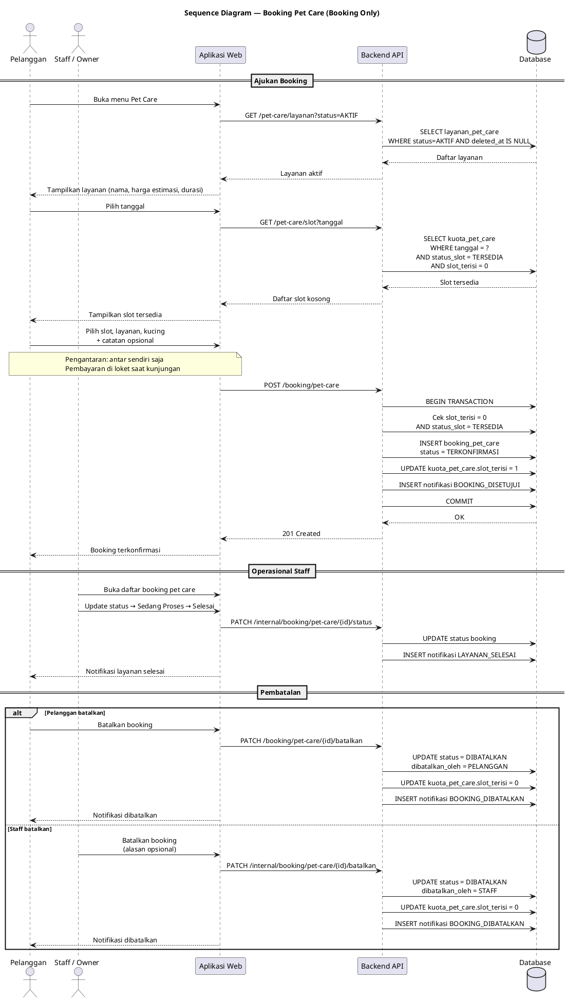

---

## 7. Pembayaran & Verifikasi Bukti Transfer

Berlaku untuk grooming & penitipan (**pet care dikecualikan**); termasuk pembatalan otomatis jika lewat batas waktu.

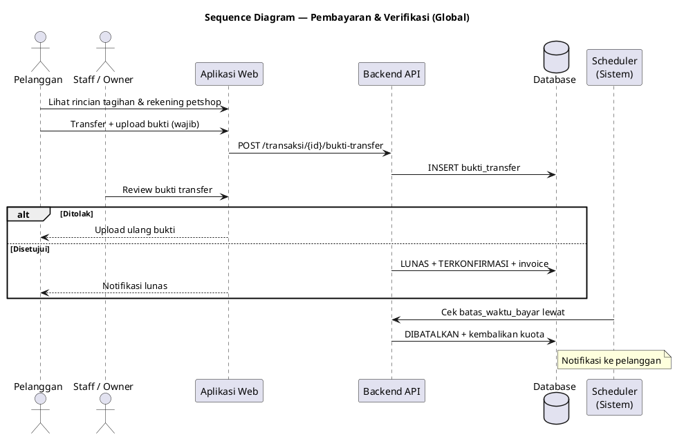

---

## 8. Pembatalan & Refund

Dua skenario: batalkan langsung (belum bayar) vs hubungi staff via WhatsApp (sudah bayar).

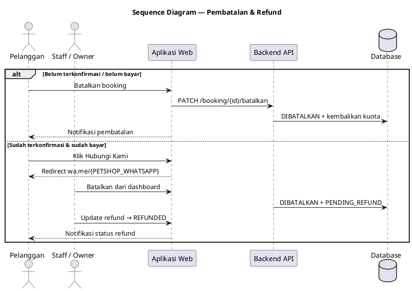

---

## 9. Monitoring Harian Penitipan

Staff input monitoring; pelanggan menerima notifikasi dan melihat riwayat.

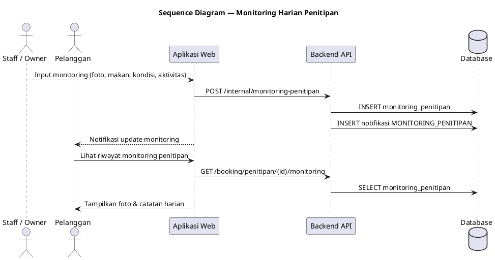

---

## 10. Perpanjangan Penitipan

Alur perpanjangan durasi penitipan setelah booking terkonfirmasi (check-in / sedang dititipkan).

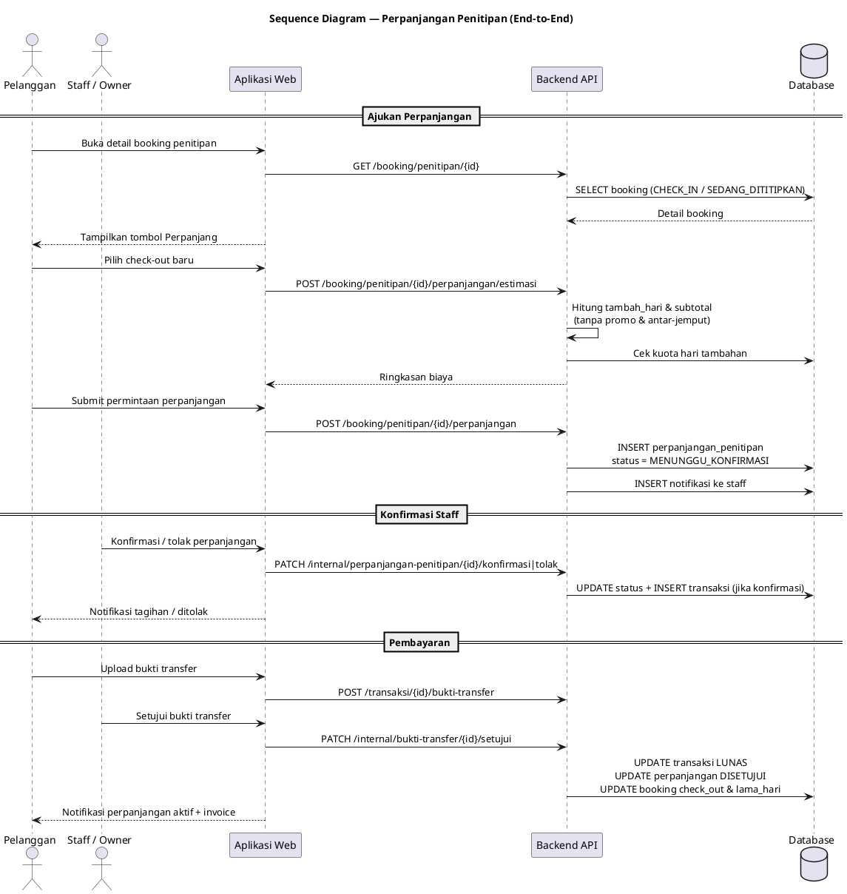

---

## 11. Manajemen Akun Staff (Owner)

Khusus owner: CRUD akun staff, reset password, aktif/nonaktif.

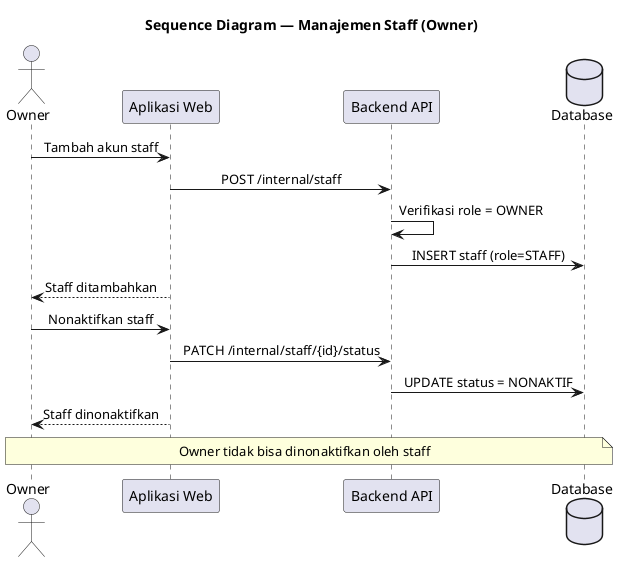

---

## 12. Laporan (Dashboard Admin)

Staff/Owner membuka menu Laporan terpisah, memfilter data per layanan, dan melihat agregat booking (serta pendapatan untuk grooming & pet hotel).

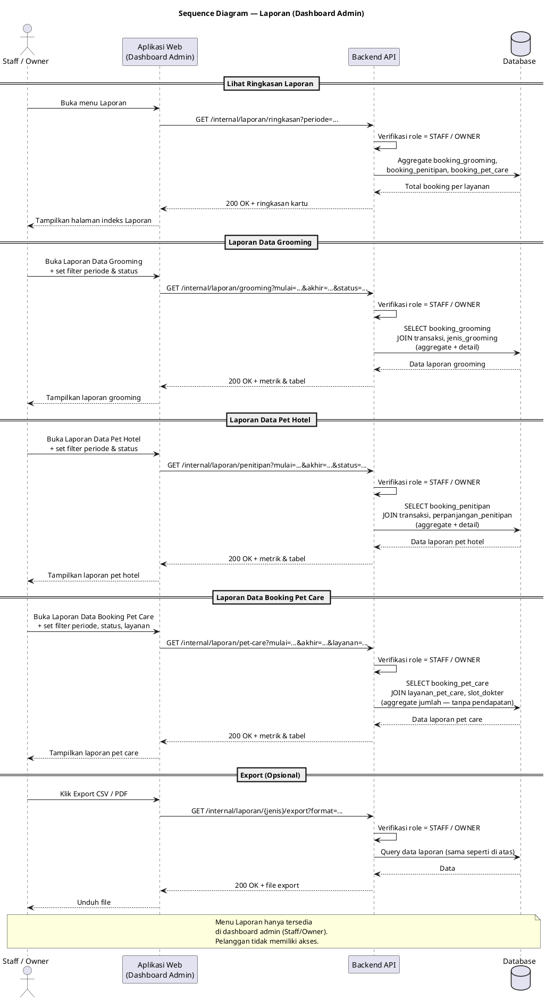

---

## Overview — Interaksi Utama Sistem

Diagram ringkas interaksi antar komponen untuk alur booking umum.

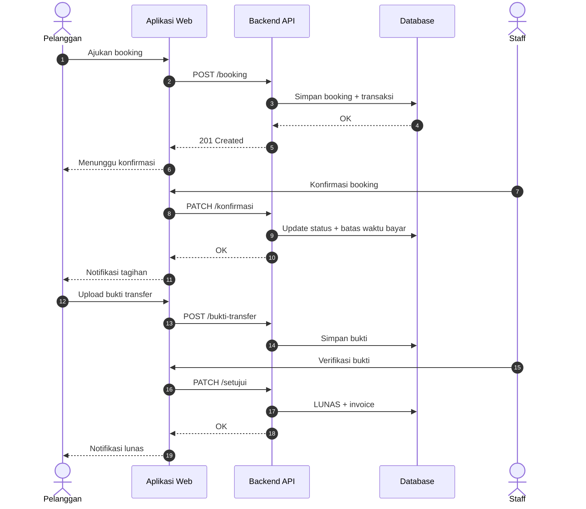

---

## Notasi & simbol

| Simbol | Arti |
|--------|------|
| `->` | Panggilan / request (sinkron) |
| `-->` | Response / return |
| `alt / else / end` | Percabangan kondisi |
| `opt / end` | Langkah opsional |
| `loop / end` | Pengulangan |
| `== ... ==` | Pemisah fase/alur |
| `note over` | Catatan pada diagram |

---

## File terkait

- Activity diagram: [activity-diagram.md](../activity/activity-diagram.md)
- Use case diagram: [usecase-diagram.md](../usecase/usecase-diagram.md)
- Class diagram: [class-diagram.md](../class/class-diagram.md)
- ERD: [erd-diagram.md](../erd/erd-diagram.md)
