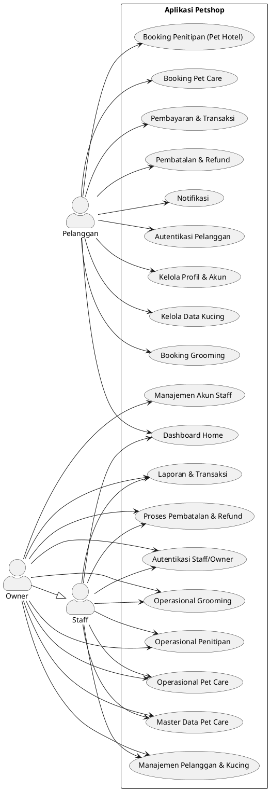
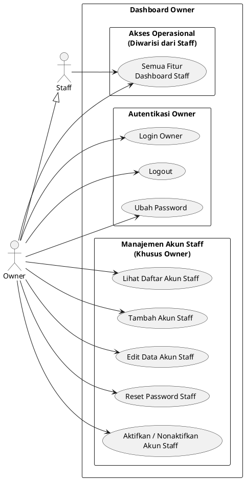
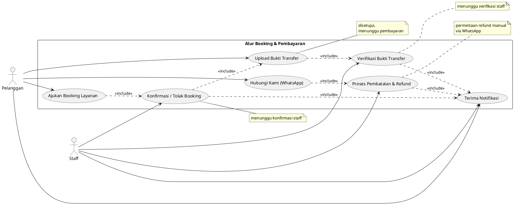

# Use Case Diagram — Aplikasi Petshop

Diagram use case berdasarkan [idea.md](../../idea.md).

**Aktor:**
- **Pelanggan** — pemilik kucing / pengguna layanan
- **Staff** — pegawai internal petshop (operasional harian)
- **Owner** — pemilik bisnis; semua akses staff + manajemen akun staff

> **Preview:** Gunakan ekstensi PlantUML di VS Code/Cursor, atau render di [plantuml.com](https://www.plantuml.com/plantuml/uml).
>
> File `.puml` terpisah: `usecase-overview.puml`, `usecase-pelanggan.puml`, `usecase-staff.puml`, `usecase-owner.puml`, `usecase-cross-actor.puml`

---

## 1. Diagram Overview

---

## 2. Pelanggan — Detail Use Case

```plantuml
@startuml usecase-pelanggan
left to right direction
skinparam packageStyle rectangle

actor Pelanggan

rectangle "Dashboard Pelanggan" {
  rectangle "Autentikasi" {
    usecase "Daftar Akun" as UC_Reg
    usecase "Login" as UC_Login
    usecase "Logout" as UC_Logout
    usecase "Lupa / Reset Password" as UC_ResetPwd
    usecase "Ubah Password" as UC_UbahPwd
  }

  rectangle "Profil & Akun" {
    usecase "Lihat & Edit Profil" as UC_LihatEditProfil
    usecase "Upload Foto Profil" as UC_UploadFotoProfil
  }

  rectangle "Data Kucing" {
    usecase "Tambah Kucing" as UC_TambahKucing
    usecase "Edit Data Kucing" as UC_EditKucing
    usecase "Hapus Data Kucing" as UC_HapusKucing
    usecase "Lihat Daftar Kucing" as UC_DaftarKucing
    usecase "Kelola Riwayat Vaksin" as UC_RiwayatVaksin
  }

  rectangle "Dashboard Home" {
    usecase "Lihat Ringkasan Dashboard" as UC_Ringkasan
    usecase "Shortcut Layanan" as UC_Shortcut
  }

  rectangle "Grooming" {
    usecase "Lihat Kuota Grooming" as UC_LihatKuotaGrooming
    usecase "Ajukan Booking Grooming" as UC_AjukanGrooming
    usecase "Lihat Status Booking Grooming" as UC_StatusGrooming
    usecase "Riwayat Grooming" as UC_RiwayatGrooming
    usecase "Batalkan Booking Grooming" as UC_BatalGrooming
    usecase "Pilih Antar-Jemput / Antar Sendiri" as UC_AntarJemputGrooming
  }

  rectangle "Penitipan (Pet Hotel)" {
    usecase "Ajukan Penitipan" as UC_AjukanPenitipan
    usecase "Validasi Syarat Vaksin" as UC_ValidasiVaksin
    usecase "Estimasi Promo Penitipan" as UC_PromoPenitipan
    usecase "Lihat Status Penitipan" as UC_StatusPenitipan
    usecase "Lihat Monitoring Harian" as UC_MonitoringPenitipan
    usecase "Riwayat Penitipan" as UC_RiwayatPenitipan
    usecase "Batalkan Penitipan" as UC_BatalPenitipan
    usecase "Pilih Antar-Jemput / Antar Sendiri" as UC_AntarJemputPenitipan
    usecase "Ajukan Perpanjangan Penitipan" as UC_AjukanPerpanjangan
    usecase "Lihat Status Perpanjangan Penitipan" as UC_StatusPerpanjangan
  }

  rectangle "Pet Care" {
    usecase "Lihat Daftar Layanan Pet Care" as UC_LihatLayananPetCare
    usecase "Ajukan Booking Pet Care" as UC_AjukanPetCare
    usecase "Lihat Status Booking Pet Care" as UC_StatusPetCare
    usecase "Riwayat Booking Pet Care" as UC_RiwayatPetCare
    usecase "Batalkan Booking Pet Care" as UC_BatalPetCare
  }

  rectangle "Pembayaran & Transaksi" {
    usecase "Lihat Tagihan Menunggu" as UC_Tagihan
    usecase "Transfer Bank Manual" as UC_Transfer
    usecase "Upload Bukti Transfer" as UC_UploadBukti
    usecase "Unduh Invoice / Struk" as UC_Invoice
    usecase "Riwayat Transaksi" as UC_RiwayatTransaksi
  }

  rectangle "Pembatalan & Refund" {
    usecase "Batalkan Langsung\n(Belum Terkonfirmasi)" as UC_BatalLangsung
    usecase "Hubungi Kami (WhatsApp)" as UC_HubungiKami
  }

  rectangle "Notifikasi" {
    usecase "Pusat Notifikasi In-App" as UC_PusatNotif
    usecase "Notifikasi Email (Opsional)" as UC_EmailNotif
  }
}

Pelanggan --> UC_Reg
Pelanggan --> UC_Login
Pelanggan --> UC_Logout
Pelanggan --> UC_ResetPwd
Pelanggan --> UC_UbahPwd
Pelanggan --> UC_LihatEditProfil
Pelanggan --> UC_UploadFotoProfil
Pelanggan --> UC_TambahKucing
Pelanggan --> UC_EditKucing
Pelanggan --> UC_HapusKucing
Pelanggan --> UC_DaftarKucing
Pelanggan --> UC_RiwayatVaksin
Pelanggan --> UC_Ringkasan
Pelanggan --> UC_Shortcut
Pelanggan --> UC_LihatKuotaGrooming
Pelanggan --> UC_AjukanGrooming
Pelanggan --> UC_StatusGrooming
Pelanggan --> UC_RiwayatGrooming
Pelanggan --> UC_BatalGrooming
Pelanggan --> UC_AjukanPenitipan
Pelanggan --> UC_StatusPenitipan
Pelanggan --> UC_MonitoringPenitipan
Pelanggan --> UC_RiwayatPenitipan
Pelanggan --> UC_BatalPenitipan
Pelanggan --> UC_AjukanPerpanjangan
Pelanggan --> UC_StatusPerpanjangan
Pelanggan --> UC_LihatLayananPetCare
Pelanggan --> UC_AjukanPetCare
Pelanggan --> UC_StatusPetCare
Pelanggan --> UC_RiwayatPetCare
Pelanggan --> UC_BatalPetCare
Pelanggan --> UC_Tagihan
Pelanggan --> UC_Transfer
Pelanggan --> UC_UploadBukti
Pelanggan --> UC_Invoice
Pelanggan --> UC_RiwayatTransaksi
Pelanggan --> UC_BatalLangsung
Pelanggan --> UC_HubungiKami
Pelanggan --> UC_PusatNotif
Pelanggan --> UC_EmailNotif

UC_AjukanGrooming ..> UC_AntarJemputGrooming : <<include>>
UC_AjukanPenitipan ..> UC_ValidasiVaksin : <<include>>
UC_AjukanPenitipan ..> UC_PromoPenitipan : <<include>>
UC_AjukanPenitipan ..> UC_AntarJemputPenitipan : <<include>>
UC_AjukanGrooming ..> UC_DaftarKucing : <<include>>
UC_AjukanPenitipan ..> UC_DaftarKucing : <<include>>
UC_AjukanPerpanjangan ..> UC_StatusPenitipan : <<include>>
UC_AjukanPetCare ..> UC_DaftarKucing : <<include>>
UC_Transfer ..> UC_UploadBukti : <<include>>

UC_BatalLangsung ..> UC_BatalGrooming : <<extend>>
UC_BatalLangsung ..> UC_BatalPenitipan : <<extend>>
UC_BatalLangsung ..> UC_BatalPetCare : <<extend>>
UC_HubungiKami ..> UC_BatalGrooming : <<extend>>
UC_HubungiKami ..> UC_BatalPenitipan : <<extend>>
UC_HubungiKami ..> UC_BatalPetCare : <<extend>>

@enduml
```

---

## 3. Staff — Detail Use Case

```plantuml
@startuml usecase-staff
left to right direction
skinparam packageStyle rectangle

actor Staff

rectangle "Dashboard Staff" {
  rectangle "Autentikasi" {
    usecase "Login Staff" as UC_LoginStaff
    usecase "Logout" as UC_LogoutStaff
    usecase "Ubah Password" as UC_UbahPwdStaff
  }

  rectangle "Dashboard Home" {
    usecase "Lihat Ringkasan Operasional" as UC_RingkasanStaff
  }

  rectangle "Operasional Grooming" {
    usecase "Kelola Kuota Grooming" as UC_KuotaGrooming
    usecase "Kelola Jenis & Harga Grooming" as UC_JenisHargaGrooming
    usecase "Lihat Daftar Booking Grooming" as UC_DaftarBookingGrooming
    usecase "Konfirmasi / Tolak Booking" as UC_KonfirmasiGrooming
    usecase "Update Jam Grooming" as UC_UpdateJamGrooming
    usecase "Verifikasi Bukti Transfer" as UC_VerifGrooming
    usecase "Update Status Layanan" as UC_StatusLayananGrooming
    usecase "Laporan Booking & Pendapatan" as UC_LaporanGrooming
  }

  rectangle "Operasional Penitipan" {
    usecase "Lihat Daftar Booking Penitipan" as UC_DaftarBookingPenitipan
    usecase "Konfirmasi / Tolak Penitipan" as UC_KonfirmasiPenitipan
    usecase "Cek Riwayat Vaksin Kucing" as UC_CekVaksin
    usecase "Kelola Kamar / Slot Penitipan" as UC_KamarPenitipan
    usecase "Kelola Paket & Harga Penitipan" as UC_PaketHargaPenitipan
    usecase "Update Status\n(Check-in/out)" as UC_StatusPenitipanStaff
    usecase "Input Monitoring Harian" as UC_InputMonitoring
    usecase "Verifikasi Bukti Transfer" as UC_VerifPenitipan
    usecase "Konfirmasi / Tolak\nPerpanjangan Penitipan" as UC_KonfirmasiPerpanjangan
    usecase "Laporan Penitipan & Pendapatan" as UC_LaporanPenitipan
  }

  rectangle "Operasional Pet Care" {
    usecase "CRUD Master Data\nLayanan Pet Care" as UC_CRUDPetCare
    usecase "Kelola Kuota / Slot Waktu" as UC_KuotaPetCare
    usecase "Lihat Daftar Booking Pet Care" as UC_DaftarBookingPetCare
    usecase "Konfirmasi / Tolak Booking" as UC_KonfirmasiPetCare
    usecase "Update Status Layanan" as UC_StatusPetCareStaff
    usecase "Verifikasi Bukti Transfer" as UC_VerifPetCare
    usecase "Laporan Booking & Pendapatan" as UC_LaporanPetCare
  }

  rectangle "Manajemen Pelanggan & Kucing" {
    usecase "Lihat Daftar Pelanggan" as UC_DaftarPelanggan
    usecase "Lihat Detail Profil Pelanggan" as UC_DetailPelanggan
    usecase "Lihat Data Kucing Pelanggan" as UC_LihatKucingPelanggan
  }

  rectangle "Laporan & Transaksi" {
    usecase "Daftar Pembayaran\nMenunggu Verifikasi" as UC_DaftarVerif
    usecase "Verifikasi Bukti Transfer\n(Global)" as UC_VerifTransfer
    usecase "Riwayat Transaksi\nSemua Layanan" as UC_RiwayatTransaksiStaff
    usecase "Laporan Pendapatan" as UC_LaporanPendapatan
    usecase "Export Data (Opsional)" as UC_ExportData
  }

  rectangle "Pembatalan & Refund" {
    usecase "Batalkan Booking (Internal)" as UC_BatalInternal
    usecase "Update Status Refund" as UC_UpdateRefund
    usecase "Kirim Notifikasi Pembatalan" as UC_NotifBatal
  }
}

Staff --> UC_LoginStaff
Staff --> UC_LogoutStaff
Staff --> UC_UbahPwdStaff
Staff --> UC_RingkasanStaff
Staff --> UC_KuotaGrooming
Staff --> UC_JenisHargaGrooming
Staff --> UC_DaftarBookingGrooming
Staff --> UC_KonfirmasiGrooming
Staff --> UC_UpdateJamGrooming
Staff --> UC_VerifGrooming
Staff --> UC_StatusLayananGrooming
Staff --> UC_LaporanGrooming
Staff --> UC_DaftarBookingPenitipan
Staff --> UC_KonfirmasiPenitipan
Staff --> UC_KamarPenitipan
Staff --> UC_PaketHargaPenitipan
Staff --> UC_StatusPenitipanStaff
Staff --> UC_InputMonitoring
Staff --> UC_VerifPenitipan
Staff --> UC_KonfirmasiPerpanjangan
Staff --> UC_LaporanPenitipan
Staff --> UC_CRUDPetCare
Staff --> UC_KuotaPetCare
Staff --> UC_DaftarBookingPetCare
Staff --> UC_KonfirmasiPetCare
Staff --> UC_StatusPetCareStaff
Staff --> UC_VerifPetCare
Staff --> UC_LaporanPetCare
Staff --> UC_DaftarPelanggan
Staff --> UC_DetailPelanggan
Staff --> UC_LihatKucingPelanggan
Staff --> UC_DaftarVerif
Staff --> UC_VerifTransfer
Staff --> UC_RiwayatTransaksiStaff
Staff --> UC_LaporanPendapatan
Staff --> UC_ExportData
Staff --> UC_BatalInternal
Staff --> UC_UpdateRefund
Staff --> UC_NotifBatal

UC_KonfirmasiPenitipan ..> UC_CekVaksin : <<include>>
UC_BatalInternal ..> UC_NotifBatal : <<include>>
UC_InputMonitoring ..> UC_NotifBatal : <<include>>
UC_UpdateRefund ..> UC_BatalInternal : <<extend>>

@enduml
```

---

## 4. Owner — Use Case Khusus

---

## 5. Relasi Antar Use Case (Cross-Actor)

---

## Catatan

| Simbol | Arti |
|--------|------|
| `-->` | Asosiasi aktor ↔ use case |
| `--\|>` | Generalisasi (Owner mewarisi Staff) |
| `..> <<include>>` | Use case wajib memanggil use case lain |
| `..> <<extend>>` | Use case opsional / kondisional |
| `rectangle` | Batas sistem atau paket use case |

- **Perpanjangan penitipan** hanya saat check-in / sedang dititipkan; staff konfirmasi ketersediaan → pelanggan bayar → verifikasi bukti (tagihan terpisah); boleh berkali-kali & paralel per booking.
- **Antar-jemput** hanya berlaku grooming & penitipan booking awal; pet care hanya antar sendiri.
- **Validasi vaksin** wajib saat booking pet hotel (minimal 1 entri jenis + tanggal).
- **Pembayaran** transfer bank manual; verifikasi bukti oleh staff wajib.
- **Refund** setelah terkonfirmasi & sudah bayar diproses manual via WhatsApp + dashboard staff/owner.
