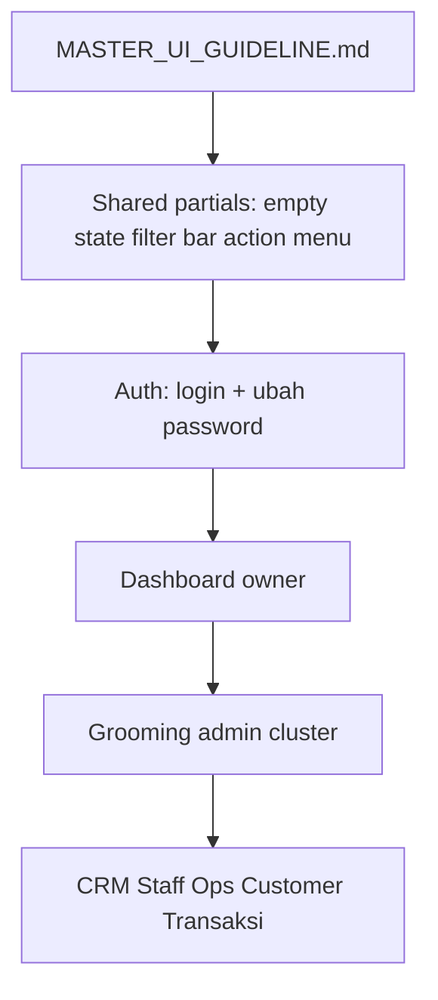

# MASTER UI Guideline – Petshop

> **Sumber eksekusi aktif** untuk implementasi UI di proyek Petshop.  
> Derived from [`Petshop Dashboard UI Guideline.md`](../Petshop%20Dashboard%20UI%20Guideline.md) dengan penyesuaian stack PHP/Tailwind.

---

## A. Panduan Eksekusi (Agent)

### Stack & Scope

| Aspek | Detail |
|---|---|
| Backend | PHP 8.4 native (bukan Laravel/React) |
| Views | [`src/Views/`](../src/Views/) — server-rendered PHP |
| CSS | Tailwind CDN + [`src/Views/partials/head/tailwind-config.php`](../src/Views/partials/head/tailwind-config.php) |
| JS | Minimal — [`public/js/nav.js`](../public/js/nav.js); tambah file baru jika perlu |
| State | PHP Session, flash messages, form POST + CSRF |

**Scope default:** UI/UX saja — edit view `.php`, partials, dan `public/js/` jika perlu. Jangan ubah business logic kecuali diperlukan untuk state baru (loading, empty, filter feedback).

**BUKAN React/shadcn** — jangan buat komponen `.tsx`.

### Urutan Kerja Per Halaman

1. Baca metadata di header file guideline target
2. Baca [`MASTER_UI_GUIDELINE.md`](./MASTER_UI_GUIDELINE.md) section B (tokens) dan C (pola global)
3. Baca section **7. High Priority Fixes** — implementasi **CRITICAL** dulu
4. Centang section **8. Acceptance Criteria** saat selesai
5. Terapkan pola global yang relevan (empty state, filter chips, dll.)
6. Verifikasi visual hierarchy + responsive (mobile/desktop)

### Definition of Done (Global)

- [ ] Warna mengikuti design tokens (section B)
- [ ] Empty / loading / error state jika halaman punya data dinamis
- [ ] Label form di atas field; error/helper text di bawah
- [ ] Form POST tetap pakai `Csrf::field()`
- [ ] Satu primary CTA per section
- [ ] Badge status pakai enum `badgeClass()` jika ada
- [ ] Tidak break route atau middleware existing

### Contoh Prompt Eksekusi

```
Implementasikan UI guideline @ui/booking_grooming_ui_guideline.md
sesuai @ui/MASTER_UI_GUIDELINE.md — fokus item CRITICAL di Acceptance Criteria.
```

---

## B. Design Tokens & Komponen

### Warna

| Token | Hex | Tailwind / Class |
|---|---|---|
| Primary | `#F97316` | `bg-primary`, `text-primary`, `hover:bg-primary-hover` |
| Primary Hover | `#EA580C` | `bg-primary-hover` |
| Success | `#16A34A` | `text-success`, `bg-success-bg` |
| Success BG | `#DCFCE7` | `bg-success-bg` |
| Warning | `#D97706` | `text-warning`, `bg-warning-bg` |
| Warning BG | `#FEF3C7` | `bg-warning-bg` |
| Danger | `#DC2626` | `text-danger`, `bg-red-*` |
| Text Primary | `#111827` | `text-content-primary`, `text-gray-800` |
| Text Secondary | `#6B7280` | `text-content-secondary`, `text-gray-600` |
| Border | `#E5E7EB` | `border`, `border-gray-200` |
| Page BG | `#F8FAFC` | `bg-page` |
| Card BG | `#FFFFFF` | `bg-card`, `bg-white` |

### Tipografi

| Elemen | Ukuran | Weight | Class umum |
|---|---|---|---|
| Page Title | 28px | 700 | `text-2xl font-bold text-gray-800` |
| Section Title | 20px | 600 | `text-xl font-semibold` |
| Card Title | 16px | 600 | `text-base font-semibold` |
| Body | 14px | 400 | `text-sm` |
| Helper Text | 12px | 400 | `text-xs text-gray-500` |

### Spacing (basis 8px)

`4` → `8` → `12` → `16` → `24` → `32` (Tailwind: `p-1` … `p-8`)

### Komponen Standar

| Komponen | Pattern |
|---|---|
| Card | `bg-white rounded-xl border p-6` |
| Admin Primary CTA | `bg-slate-800 text-white rounded-lg px-4 py-2 hover:bg-slate-700` |
| Pelanggan Primary CTA | `bg-orange-600 text-white rounded-lg px-4 py-2 hover:bg-orange-700` |
| Secondary Button | `border border-gray-300 rounded-lg px-4 py-2 hover:bg-gray-50` |
| Table | `bg-white rounded-xl border overflow-hidden` + `thead bg-gray-50` |
| Empty State | centered card: icon + title + description + CTA |
| Badge | `text-xs px-2 py-1 rounded-full` via `Enums/*::badgeClass()` |

### Inkonsistensi yang Harus Diperbaiki

- Layout guest (`guest-admin`, `guest`) **tidak** load `tailwind-config.php` — pertimbangkan unify saat implementasi auth pages
- Admin pages sering pakai `gray-*`/`slate-*` raw, bukan token `primary`/`content-*`
- Grooming admin tabs duplikat di 4 view — ekstrak ke partial `_subnav.php`

### Partial yang Bisa Di-reuse

- [`src/Views/partials/flash.php`](../src/Views/partials/flash.php)
- [`src/Views/partials/nav/admin-nav.php`](../src/Views/partials/nav/admin-nav.php)
- [`src/Views/partials/nav/pelanggan-nav.php`](../src/Views/partials/nav/pelanggan-nav.php)
- [`src/Views/helpers/navigation.php`](../src/Views/helpers/navigation.php)
- [`src/Views/admin/laporan/_subnav.php`](../src/Views/admin/laporan/_subnav.php)

---

## C. Pola UX Global

### 1. Empty State

Tiga variant wajib dibedakan:

| Variant | Pesan contoh | CTA |
|---|---|---|
| Kosong | "Belum ada data tercatat" | Aksi utama (Buat Baru / Ajukan) |
| Filtered | "Tidak ditemukan data untuk filter yang dipilih" | Reset Filter |
| Success empty | "Semua item sudah diproses" | — atau navigasi terkait |

Struktur: icon (centered) + title semibold + description secondary + CTA button.

### 2. Filter Bar

- Active filter chips (removable)
- Counter hasil: "Menampilkan N item"
- Tombol Reset Filter
- Preset tanggal opsional: Hari ini, 7 hari, 30 hari
- Basic vs Advanced (collapsible) untuk filter kompleks

### 3. Admin Table

- Search + filter + sort + pagination
- Row action menu `⋮` (Edit, Detail, Hapus)
- **Jangan** expose tombol Delete langsung di row
- Optional: row click → detail drawer

### 4. Status Badge

- Kombinasi **warna + teks** (bukan warna saja)
- Gunakan enum existing: `StatusPembayaran`, `StatusBookingGrooming`, `StatusRefund`
- Warna semantik: green=sukses, yellow=menunggu, blue=proses, red=urgent/gagal

### 5. Destructive Action

- Sembunyikan di action menu `⋮`
- Wajib confirm modal dengan pesan jelas
- Tombol danger: `text-danger` atau `bg-red-600`

### 6. Form Sections

- Grouping card: Basic Info → Detail → System Settings
- Label di atas, helper/error di bawah
- Default status baru = **Draft** (bukan Aktif)
- Submit disabled sampai valid (client-side optional)
- Review/confirmation modal untuk form sensitif

### 7. Tab Navigation

- Tab harus switch **route + dataset** nyata, bukan label visual saja
- Active tab: `border-b-2 border-slate-800 font-medium`
- Inactive: `text-gray-500 hover:text-slate-800`
- Referensi cluster: grooming admin (Jenis / Kuota / Booking / Verifikasi)

### 8. Priority Layers (Dashboard)

Urutan vertikal:

1. **Action Center** — urgent tasks (verifikasi, pending approval)
2. **KPI Overview** — metrics hari ini/minggu ini
3. **Insights** — charts, trends, comparison

---

## D. Index 20 Halaman

| Modul | File Guideline | Route | View Target | Controller | Layout |
|---|---|---|---|---|---|
| Auth | [`login_admin_ui_guideline.md`](./login_admin_ui_guideline.md) | `/admin/login` | `src/Views/auth/admin/login.php` | `Auth\StaffAuthController` | `guest-admin` |
| Auth | [`ubah_password_ui_guideline.md`](./ubah_password_ui_guideline.md) | `/admin/change-password` | `src/Views/auth/admin/change-password.php` | `Auth\StaffAuthController` | `admin` |
| Dashboard | [`dashboard_owner_ui_guideline.md`](./dashboard_owner_ui_guideline.md) | `/admin/dashboard` | `src/Views/dashboard/admin.php` | `Admin\DashboardController` | `admin` |
| Grooming Admin | [`jenis_grooming_ui_guideline.md`](./jenis_grooming_ui_guideline.md) | `/admin/grooming/layanan` | `src/Views/admin/grooming/layanan/index.php` | `Admin\GroomingController` | `admin` |
| Grooming Admin | [`kuota_grooming_ui_guideline.md`](./kuota_grooming_ui_guideline.md) | `/admin/grooming/kuota` | `src/Views/admin/grooming/kuota/index.php` | `Admin\GroomingController` | `admin` |
| Grooming Admin | [`tambah_kuota_grooming_ui_guideline.md`](./tambah_kuota_grooming_ui_guideline.md) | `/admin/grooming/kuota/tambah` | `src/Views/admin/grooming/kuota/form.php` | `Admin\GroomingController` | `admin` |
| Grooming Admin | [`booking_grooming_ui_guideline.md`](./booking_grooming_ui_guideline.md) | `/admin/grooming/booking` | `src/Views/admin/grooming/booking/index.php` | `Admin\GroomingController` | `admin` |
| Grooming Admin | [`verifikasi_bukti_transfer_ui_guideline.md`](./verifikasi_bukti_transfer_ui_guideline.md) | `/admin/grooming/pembayaran` | `src/Views/admin/grooming/pembayaran/index.php` | `Admin\GroomingController` | `admin` |
| Pet Care Admin | [`layanan_petcare_ui_guideline.md`](./layanan_petcare_ui_guideline.md) | `/admin/pet-care/layanan` | `src/Views/admin/pet-care/layanan/index.php` | `Admin\PetCareController` | `admin` |
| Pet Care Admin | [`tambah_layanan_ui_guideline.md`](./tambah_layanan_ui_guideline.md) | `/admin/pet-care/layanan/tambah` | `src/Views/admin/pet-care/layanan/form.php` | `Admin\PetCareController` | `admin` |
| CRM | [`manajemen_pelanggan_ui_guideline.md`](./manajemen_pelanggan_ui_guideline.md) | `/admin/pelanggan` | `src/Views/admin/pelanggan/index.php` | `Admin\PelangganController` | `admin` |
| Staff | [`manajemen_staff_ui_guideline.md`](./manajemen_staff_ui_guideline.md) | `/admin/staff` | `src/Views/admin/staff/index.php` | `Admin\StaffManagementController` | `admin` |
| Staff | [`tambah_staff_ui_guideline.md`](./tambah_staff_ui_guideline.md) | `/admin/staff/tambah` | `src/Views/admin/staff/form.php` | `Admin\StaffManagementController` | `admin` |
| Operations | [`notifikasi_ui_guideline.md`](./notifikasi_ui_guideline.md) | `/admin/notifikasi` | `src/Views/admin/notifikasi/index.php` | `Admin\NotifikasiController` | `admin` |
| Operations | [`laporan_ui_guideline.md`](./laporan_ui_guideline.md) | `/admin/laporan` | `src/Views/admin/laporan/index.php` | `Admin\LaporanController` | `admin` |
| Operations | [`pengaturan_bisnis_ui_guideline.md`](./pengaturan_bisnis_ui_guideline.md) | `/admin/pengaturan` | `src/Views/admin/pengaturan/form.php` | `Admin\PengaturanController` | `admin` |
| Customer | [`grooming_ui_guideline.md`](./grooming_ui_guideline.md) | `/grooming` | `src/Views/grooming/index.php` | `Pelanggan\GroomingController` | `pelanggan` |
| Customer | [`tambah_kucing_ui_guideline.md`](./tambah_kucing_ui_guideline.md) | `/kucing/tambah` | `src/Views/kucing/form.php` | `Pelanggan\KucingController` | `pelanggan` |
| Transaksi | [`riwayat_transaksi_ui_guideline.md`](./riwayat_transaksi_ui_guideline.md) | `/transaksi` | `src/Views/transaksi/index.php` | `Pelanggan\TransaksiController` | `pelanggan` |
| Transaksi | [`riwayat_transaksi_advanced_ui_guideline.md`](./riwayat_transaksi_advanced_ui_guideline.md) | `/admin/transaksi` | `src/Views/admin/transaksi/index.php` | `Admin\TransaksiController` | `admin` |

### Urutan Eksekusi Disarankan



1. Shared partials (empty state, filter chips) — optional refactor first
2. Auth cluster
3. Dashboard owner
4. Grooming admin cluster (5 files)
5. Pet Care, CRM, Staff, Operations, Customer, Transaksi

---

## E. Template Standar File Per-Halaman

Setiap file guideline di folder `ui/` harus mengikuti struktur:

```markdown
# UI Design Guideline – [Nama Halaman]

> **Modul:** ...
> **Audience:** ...
> **Route:** ...
> **Layout:** ...
> **View:** [path](../src/Views/...)
> **Controller:** ...
> **Related:** [file](./file.md), ...
> **Master:** [MASTER_UI_GUIDELINE.md](./MASTER_UI_GUIDELINE.md)

## 0. Cara Eksekusi
- Baca master guideline untuk tokens & pola global
- Implementasi dimulai dari section 8 (Acceptance Criteria) item CRITICAL
- Jangan ubah route/controller kecuali state UI baru membutuhkannya

## 1. Critical UX Issue (Core Finding)
## 2. Key UX Observations
## 3. Core UX Problems
## 4. Recommended Improvements
## 5. Component Recommendations
## 6. Layout Structure (Improved)
## 7. High Priority Fixes
## 8. Acceptance Criteria
## 9. Cross-References
```

---

## Microcopy

- Bahasa: **Indonesia** ringkas dan jelas
- Title Case untuk judul section
- Sentence case untuk deskripsi dan helper text
- Istilah konsisten: "Ajukan Grooming", "Tambah Kucing", "Lihat Detail"
